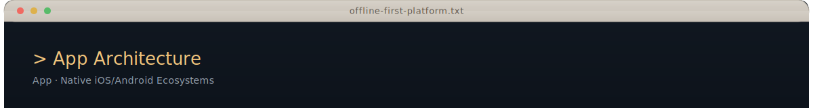
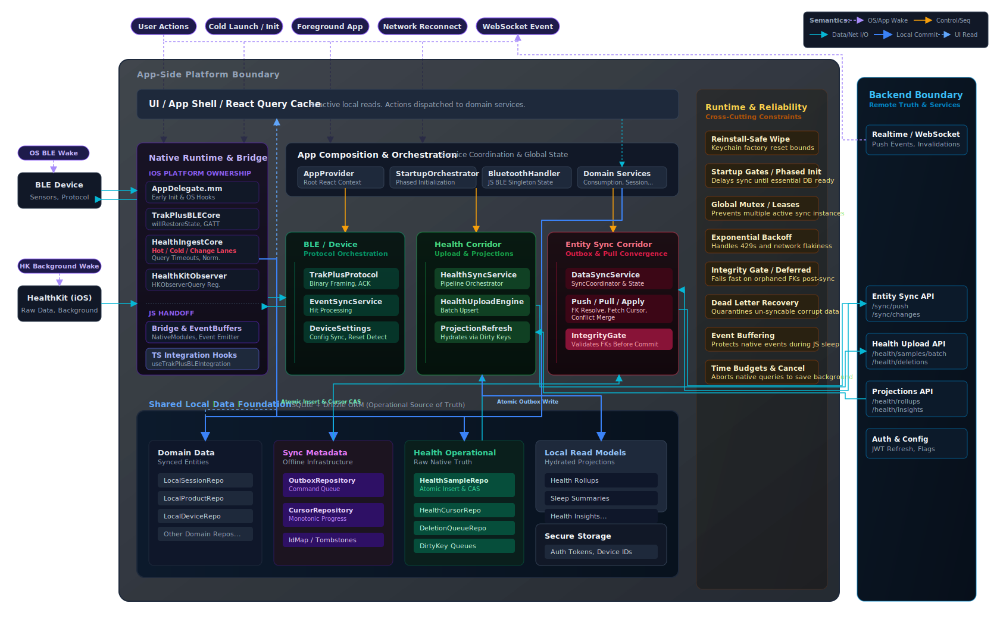
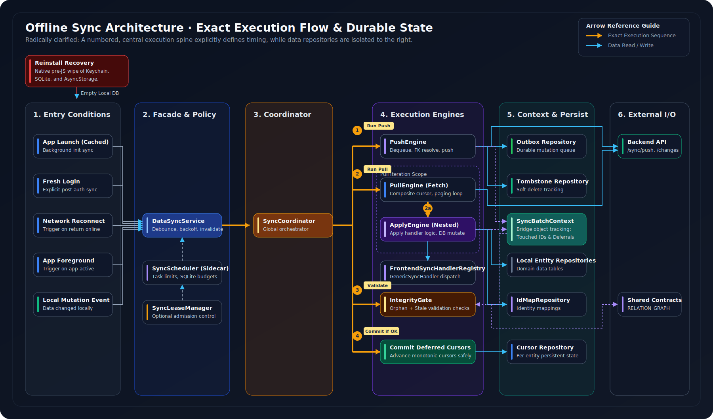
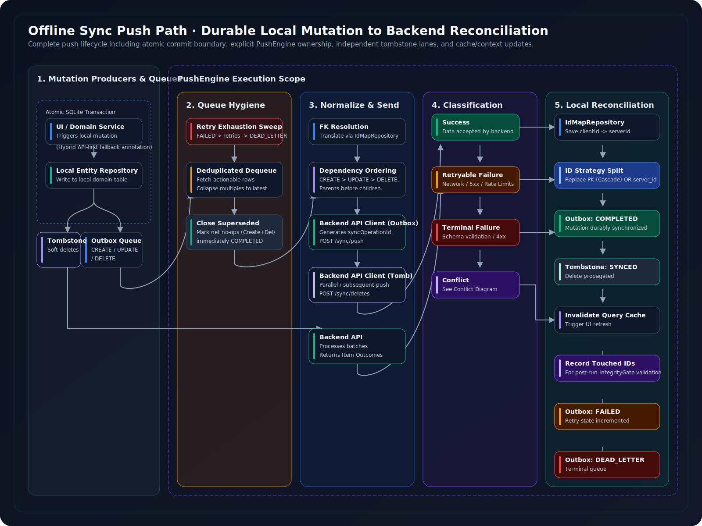
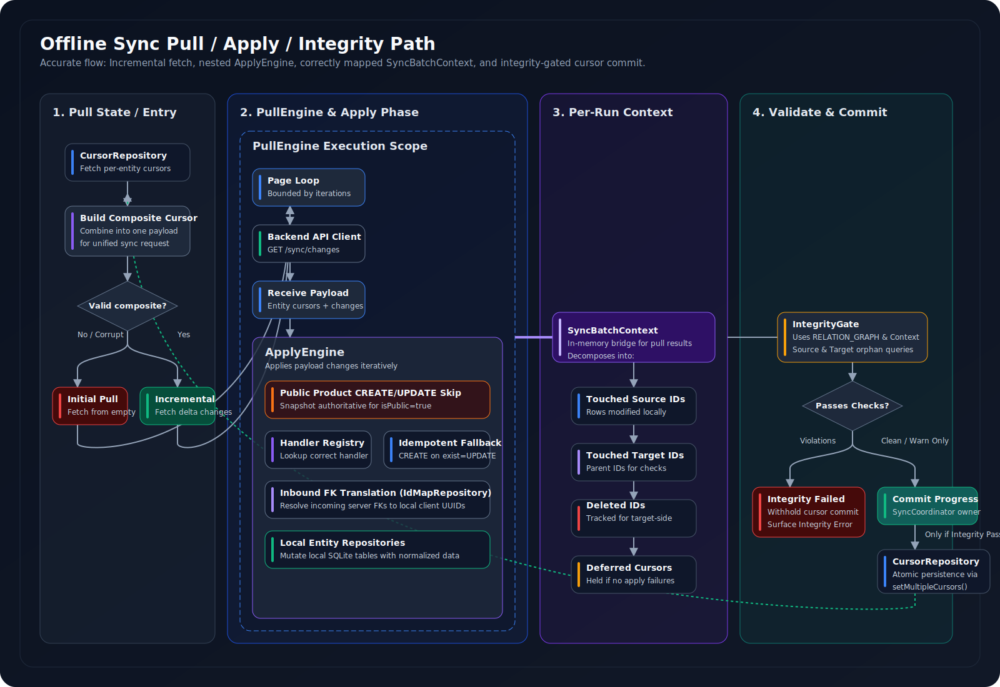
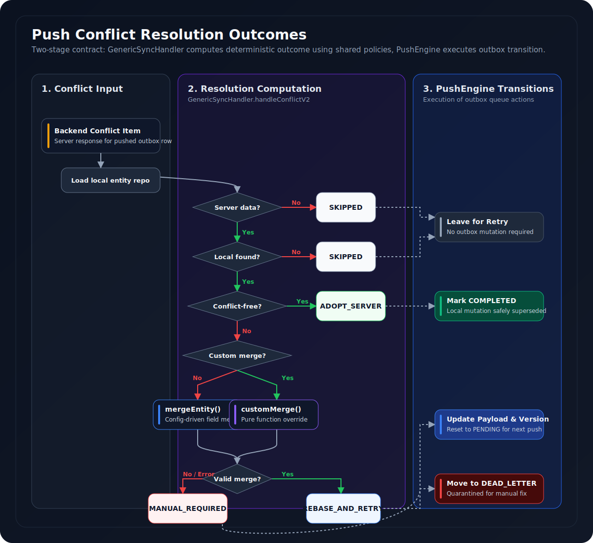
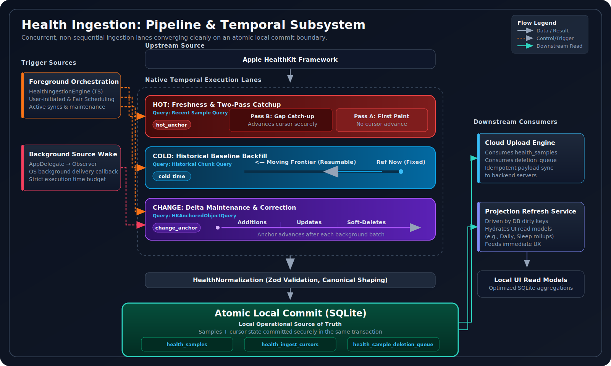
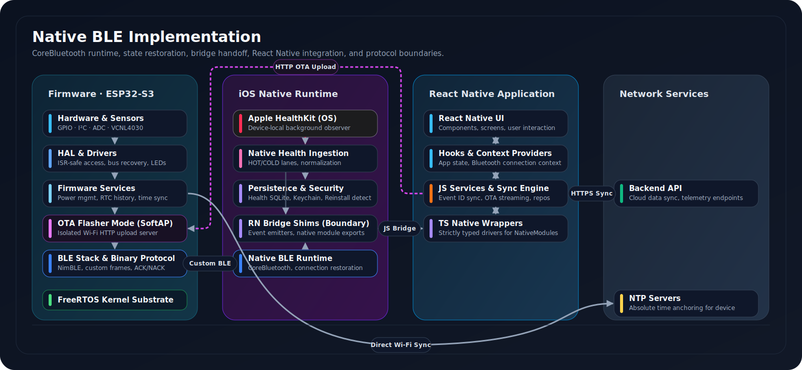

<div align="center">
  

 

  
</div>

<br>

<div align="left">
  <a href="https://testflight.apple.com/join/PJQFcf2G"></a>
  <br><br>
  <strong>You can test the live beta on your iPhone:</strong><br>
  1. Install <a href="https://apps.apple.com/app/testflight/id899247664">TestFlight</a> from the App Store<br>
  2. Open the <a href="https://testflight.apple.com/join/PJQFcf2G">beta invite link</a> and tap <strong>Accept</strong><br>
  3. Download the app from TestFlight.
</div>

<br>

## Overview

This repository contains the architecture for an offline-first, device-connected mobile platform built with React Native, deep native iOS runtime integrations, and a Node.js backend.

The system is designed for the real world, not the happy path. It handles intermittent connectivity, strict mobile OS lifecycle constraints, high-volume health data ingestion, and BLE device communication under background execution limits. The architecture prioritizes **local data ownership**, **sync correctness**, and **native runtime resilience**. The platform remains functional, observable, and recoverable under all operating conditions.

<br>

## Technology Stack


<table>
<tr>
<td><strong>Languages</strong></td>
<td>  </td>
</tr>
<tr>
<td><strong>Mobile Framework</strong></td>
<td>  </td>
</tr>
<tr>
<td><strong>Local Storage</strong></td>
<td> </td>
</tr>
<tr>
<td><strong>BLE & Device</strong></td>
<td> </td>
</tr>
<tr>
<td><strong>Health Platforms</strong></td>
<td> </td>
</tr>
<tr>
<td><strong>State & Validation</strong></td>
<td> </td>
</tr>
<tr>
<td><strong>Backend Integration</strong></td>
<td> </td>
</tr>
<tr>
<td><strong>Testing</strong></td>
<td> </td>
</tr>
</table>

<br>

## Engineering Principles

### 1. Treat local state as the durable interaction layer
The UI reads and writes against SQLite. Mutations are persisted locally and queued in a transactional outbox before any network call. The user experience is never gated on server availability.

> **Goal:** Preserve instant responsiveness and offline functionality as a baseline, not a fallback.

### 2. Isolate native runtime from JavaScript orchestration
BLE restoration, HealthKit background delivery, and reinstall detection require native lifecycle hooks that fire before the React Native bridge exists. Native code owns the platform boundary. TypeScript owns application logic.

> **Goal:** Meet strict OS timing constraints without coupling platform correctness to bridge availability.

### 3. Separate sync pipelines by data semantics
Entity sync (consumptions, sessions, products) and health sync (samples, projections) follow entirely different correctness models. Entity data uses a transactional outbox with cursor-based pull and post-sync integrity validation. Health data uses lane-based native ingestion with atomic cursor advancement and a push-only upload path.

> **Goal:** Prevent contention between high-volume health ingestion and transactional business entity synchronization.

### 4. Enforce explicit correctness boundaries
Cursors advance monotonically. Outbox writes are atomic with local mutations. An integrity gate validates foreign key relationships after every sync cycle. Deferred cursor commit ensures cursors never advance past corrupted state.

> **Goal:** Make data corruption structurally impossible rather than relying on runtime checks alone.

### 5. Design for recovery, not just the happy path
iOS Keychain persists across uninstalls. BLE bonds break silently. Background execution budgets expire mid-operation. Recovery paths—reinstall detection, bounded reset guards, restoration handlers, crash-safe atomic persistence—are treated as primary operating modes.

> **Goal:** A reliable system fails into a bounded, recoverable state, not into silent corruption.

---

## Offline-First Entity Sync

The entity synchronization system enables users to interact with their data instantly, even offline, with changes durably stored in SQLite. Local mutations are propagated to the backend, server changes are applied locally, consistency is maintained through conflict resolution, and relational integrity is validated after every sync cycle. This is a first-class platform concern built around a composable engine stack.

### Architecture

The sync pipeline follows a layered design orchestrated by `DataSyncService`. The `SyncCoordinator` sequences three engines — Push, Pull, Apply — backed by dedicated SQLite repositories for the transactional outbox, cursors, ID maps, and tombstones. An `IntegrityGate` validates foreign key correctness before cursors are committed.

<div align="center">
  
</div>

<br>

### Push Path

When a user creates, updates, or deletes an entity, the domain service performs a **single atomic SQLite transaction** that both updates the local table and enqueues a command in the `OutboxRepository`. The `PushEngine` dequeues commands, performs in-memory deduplication (multiple updates collapse to latest; create-then-delete cancels), resolves client-generated UUIDs to server IDs via `IdMapRepository`, and orders commands by entity dependency (parents before children). Commands are submitted in an idempotent batch with a deterministic `syncOperationId` (SHA-256 hash of outbox event IDs). On success, ID mappings are stored and FK cascades replace client IDs throughout the local database. Failed commands enter retry or dead-letter queues.

> **Guarantee:** A local change is never committed without a corresponding outbox entry. No mutation is silently lost.

<div align="center">
  
</div>

<br>

### Pull, Apply, and Integrity Validation

The `PullEngine` builds a composite cursor from per-entity `CursorRepository` state and fetches deltas from the backend's `/sync/changes` endpoint. The `ApplyEngine` applies received changes (CREATE, UPDATE, DELETE) to local SQLite via the `FrontendSyncHandlerRegistry`, tracking all touched entity IDs. Cursor updates are **deferred** — they are NOT committed until the `IntegrityGate` passes.

The `IntegrityGate` uses the shared `RELATION_GRAPH` to detect orphaned foreign key references in the local database. It performs scoped queries against touched IDs for efficiency. In fail-fast mode, required FK violations throw `IntegrityViolationError` and the sync is aborted — cursors do not advance, guaranteeing the corrupted batch is re-fetched on the next cycle.

> **Guarantee:** Cursors never advance past corrupted state. Data integrity is enforced structurally, not by convention.

<div align="center">
  
</div>

<br>

### Conflict Resolution

Conflicts are handled by the `GenericSyncHandler` using `ENTITY_CONFLICT_CONFIG` from shared contracts. This config-driven model defines per-field policies (`SERVER_WINS`, `LOCAL_WINS`, `LAST_WRITE_WINS`, `MERGE_ARRAYS`, `MONOTONIC`) and server-derived fields that are always authoritative. Complex entities delegate to pure `customMerge` functions — stateless, side-effect-free, and deterministic. Resolution yields an explicit `ConflictResolutionOutcome` (`ADOPT_SERVER`, `REBASE_AND_RETRY`, `MANUAL_REQUIRED`, `SKIPPED`) that dictates outbox actions. Unresolvable conflicts enter a dead-letter queue.

<div align="center">
  
</div>

<br>

> For full implementation details — coordination, failure handling, cursor semantics, and verification — see [**docs/offline-sync.md**](docs/offline-sync.md).

---

## Health Ingestion Pipeline

The Health Ingestion subsystem reliably acquires user health data from Apple HealthKit through an iOS-native ingestion runtime, architected around a lane-based prioritization model. Normalized samples are persisted atomically into a local SQLite store. A TypeScript driver and engine layer manages the lifecycle from raw ingestion through cloud upload and local read-model projection refresh.

### Why a Separate Pipeline

Health data is fundamentally different from entity data: it arrives at high frequency (heart rate every minute), uses append-only semantics with soft-deletes, requires tight coupling with platform-specific background APIs, and operates under strict OS execution budgets (15 seconds for background delivery). Folding this into the entity sync pipeline would cause performance contention and correctness complexity. Health sync shares coordination infrastructure (`SyncScheduler`, `SyncLeaseManager`) but maintains its own engines, repositories, and failure models.

### Pipeline Overview

<div align="center">
  
</div>

<br>

### Lane Architecture: Hot, Cold, and Change

The native `HealthIngestCore` manages three dedicated `OperationQueue`s, each with distinct QoS and purpose:

*   **HOT Lane** (`.userInitiated`) — Queries recent data for immediate UI display. Uses a sliding window with per-metric watermarks and a two-pass strategy (first-paint then catch-up) for responsiveness after user absence.
*   **COLD Lane** (`.utility`) — Historical backfill walking backward to fill a 90-day window. Implements dynamic per-metric chunk reservation and cross-invocation fairness.
*   **CHANGE Lane** (`.default`) — Uses `HKAnchoredObjectQuery` to detect additions and deletions since the last anchor. Triggered by both active use and background HealthKit delivery. Critical for propagating deletions.

Each lane has its own `AtomicBool` cancellation flag to prevent orphaned native work when the JS bridge times out. `HealthIngestSQLite` performs atomic inserts and cursor updates using the SQLite C API with `BEGIN IMMEDIATE` — samples are only considered persisted if their cursor also advances in the same transaction.

> **Guarantee:** Zero data loss under background termination. Atomic cursor advancement prevents skipped or duplicated ingestion windows.

<div align="center">
  
</div>

<br>

> For full implementation details — native runtime, normalization, upload engine, projection refresh, and verification — see [**docs/health-ingestion.md**](docs/health-ingestion.md).

---

## Native BLE Subsystem

The BLE subsystem is a native-integrated, resilient device communication layer. It features a deeply embedded iOS-native CoreBluetooth runtime, a robust React Native bridge with buffered event delivery, and a TypeScript orchestration layer that intelligently selects between native transport and a `react-native-ble-plx` fallback.

### Why Native BLE

Two critical mobile OS realities drive the native approach:

1.  **CoreBluetooth State Restoration:** iOS requires `CBCentralManager` to be created *early* in the app lifecycle with `CBCentralManagerOptionRestoreIdentifierKey` for `willRestoreState` to be delivered. React Native initializes native modules lazily — a JS-driven approach would miss this critical window, losing connection state on app termination.

2.  **Background Resilience:** A native, early-initialized BLE runtime ensures persistent connection management and reliable event delivery without constant JavaScript intervention, allowing the OS to manage BLE connections across app lifecycle transitions.

### Architecture

<div align="center">
  
</div>

<br>

**Layered Design:**

| Layer | Component | Responsibility |
| :--- | :--- | :--- |
| **Native Transport** | `AppDeviceBLECore.swift` | Singleton `CBCentralManager` owner. State restoration, GATT discovery, MTU negotiation, explicit disconnect classification (`bondingLost`, `encryptionFailed`, `deviceSleep`). |
| **Bridge** | `AppDeviceBLEModule.swift` | `RCTEventEmitter` with `EventBuffer` for buffered delivery when JS listeners are absent. Overflow reporting via `onBufferOverflow`. |
| **JS Integration** | `AppDeviceBLE.ts` / `useAppDeviceBLEIntegration.ts` | Type-safe wrapper and React hook forwarding native events to `BluetoothHandler`. |
| **Protocol** | `AppDeviceProtocolService.ts` | Custom binary frames with CRC16 checksums, sequence numbers, ACK/NACK, and event deduplication by `eventId`. |
| **Orchestration** | `BluetoothService.ts` / `BLERestorationService.ts` | High-level scanning, connection, reconnection with backoff, dormant mode, and device lifecycle management via `OutboxRepository`. |

**Event Flow:** `AppDeviceBLECore` → `AppDeviceBLEModule` (RCTEventEmitter) → `useAppDeviceBLEIntegration` hook → `BluetoothHandler` → `BluetoothService` and `AppDeviceProtocolService`.

> **Guarantee:** BLE connections survive app termination. Native events are buffered until the JS bridge is ready. No events are silently dropped.

> For full implementation details — bridge design, transport selection, protocol boundary, and verification — see [**docs/nativeBLE.md**](docs/nativeBLE.md).

---

## Hardest Problems Solved

### 1. CoreBluetooth State Restoration Under React Native Lifecycle

**Problem:** iOS delivers `willRestoreState` to `CBCentralManager` only if it was created early in the app lifecycle with a restoration identifier. React Native initializes native modules lazily — a JavaScript-driven BLE approach misses this critical window entirely, losing connection state when iOS terminates the app in the background.

**Solution:** `AppDeviceBLECore` is a native singleton initialized in `AppDelegate` with `CBCentralManagerOptionRestoreIdentifierKey`, before the React Native bridge exists. The `EventBuffer` in the bridge module queues all BLE events until JavaScript listeners attach. Overflow is explicitly reported via `onBufferOverflow` — no events are silently dropped.

### 2. Atomic Persistence Under iOS Background Termination

**Problem:** iOS HealthKit background delivery grants approximately 15 seconds of execution. Health samples must be persisted atomically with their ingestion cursors — if samples are written but the cursor isn't advanced, the next invocation re-ingests duplicates. If the cursor advances but samples aren't written, data is permanently lost.

**Solution:** `HealthIngestSQLite` uses the SQLite C API with `BEGIN IMMEDIATE` transactions. Samples and cursor advancement are written in a single atomic commit. Each lane has its own `AtomicBool` cancellation flag so the TypeScript driver can terminate orphaned native work when the JS bridge times out. If the OS kills the process mid-transaction, SQLite's journal-based rollback ensures neither samples nor cursors are left in a partial state.

### 3. Structural Data Integrity Without Server Validation

**Problem:** In an offline-first system, the client applies server-sent changes locally without a round-trip validation step. A missing parent entity (e.g., a product referenced by a consumption) creates orphaned foreign keys that corrupt local queries and break subsequent sync cycles.

**Solution:** The `IntegrityGate` runs after every pull-apply cycle, before cursors are committed. It uses the shared `RELATION_GRAPH` to query all foreign key relationships for every touched entity ID. In fail-fast mode, any violation throws `IntegrityViolationError` — the entire batch is rejected, cursors do not advance, and the corrupted batch is re-fetched on the next cycle. Integrity is enforced structurally through deferred cursor commit, not by trusting the server payload.

<br>

## Layering and Ownership

| Subsystem | Native (iOS) Responsibility | TypeScript Responsibility | Key Interfaces |
| :--- | :--- | :--- | :--- |
| **BLE Runtime** | CoreBluetooth ownership, state restoration, GATT pipeline, disconnect classification. | Protocol parsing, reconnection strategy, device service orchestration. | CBCentralManager, NativeModules, EventEmitter |
| **Health Ingestion** | HKObserverQuery registration, lane-based OperationQueues, atomic SQLite C API. | Driver orchestration, upload engine, projection refresh, dirty-key hydration. | HealthKit, OperationQueue, NativeModules |
| **Reinstall Recovery** | Keychain marker detection, sandbox sentinel, bounded factory reset guard. | — | Security.framework, UserDefaults |
| **Local Persistence** | Direct SQLite C API for crash-safe health ingest. | Drizzle ORM repositories, schema management, migrations. | SQLite, expo-sqlite |
| **Entity Sync** | — | Outbox, push/pull engines, integrity gate, conflict resolution, cursor management. | Backend REST API, SyncCoordinator |
| **Startup** | Early BLE init, HealthKit observer registration, reinstall check. | Phased orchestration (critical → essential → background → deferred). | AppDelegate, StartupOrchestrator |

<br>
---

## Deep Dive: Technical Documentation

For granular analysis of each subsystem, refer to the domain-specific documentation below:

| Document | Focus Area |
| :--- | :--- |
| [**System Architecture**](docs/architecture.md) | Layered system model, service boundaries, data ownership, and lifecycle orchestration. |
| [**Offline Entity Sync**](docs/offline-sync.md) | Transactional outbox, cursor-based pull, conflict resolution, and integrity validation. |
| [**Health Ingestion Pipeline**](docs/health-ingestion.md) | Native iOS ingestion lanes, atomic persistence, upload path, and projection refresh. |
| [**Native BLE Subsystem**](docs/nativeBLE.md) | CoreBluetooth runtime, state restoration, bridge design, and protocol boundaries. |
| [**Data Flow Map**](docs/data-flow.md) | End-to-end data movement across layers, pipelines, and external boundaries. |
| [**Failure Modes**](docs/failure-modes.md) | Reliability domains, containment mechanisms, and recovery strategies. |

<br>

## Architectural & Reliability Patterns

| Pattern | Implementation |
| :--- | :--- |
| **Transactional Local Outbox** | Atomic SQLite write + outbox enqueue; no mutation committed without a sync command |
| **Deferred Cursor Commit** | Cursors advance only after IntegrityGate validates FK correctness; corrupted batches re-fetched |
| **Config-Driven Conflict Resolution** | `ENTITY_CONFLICT_CONFIG` with field-level policies from shared contracts |
| **Lane-Based Health Ingestion** | HOT / COLD / CHANGE lanes with independent QoS, cancellation, and cursor tracking |
| **Native BLE State Restoration** | Early-initialized `CBCentralManager` with `EventBuffer` for bridge-safe delivery |
| **Atomic Cursor Advancement** | SQLite `BEGIN IMMEDIATE` ensures samples and cursors commit or rollback together |
| **Integrity Gate Validation** | Post-pull FK verification using shared `RELATION_GRAPH` before cursor commit |
| **Reinstall Detection** | iOS Keychain marker + sandbox sentinel with bounded factory reset guard |

---


---

<details>
<summary><h2>Folder Structure</h2></summary>
<br>

```
.
├── README.md
├── docs/                                   # Deep-dive technical documentation
│   ├── architecture.md
│   ├── data-flow.md
│   ├── failure-modes.md
│   ├── health-ingestion.md
│   ├── nativeBLE.md
│   └── offline-sync.md
├── media/
│   ├── demos/                              # App screen recordings & demo videos
│   ├── diagrams/                           # Architecture & flow SVGs
│   └── screenshots/                        # App screenshots (BLE, HealthKit, sync)
├── src/                                    # TypeScript application source
│   ├── constants/                          # App constants (BLE UUIDs, theme tokens)
│   ├── contexts/                           # React contexts (Bluetooth)
│   ├── db/
│   │   └── schema.ts                       # Drizzle ORM SQLite schema
│   ├── hooks/                              # Custom React hooks (sync, health, BLE, sleep)
│   ├── migrations/                         # SQLite migration definitions
│   ├── native/                             # JS-side native module wrappers (BLE bridge)
│   ├── providers/                          # App-level React providers
│   ├── repositories/
│   │   ├── offline/                        # Outbox, cursor, ID map, tombstone repositories
│   │   └── health/                         # Local projection read models (rollups, sleep, impact)
│   ├── services/
│   │   ├── ble/                            # BLE device communication & binary protocol
│   │   │   ├── protocol/                   # Binary framing, CRC16, message types
│   │   │   ├── ota/                        # OTA state machine & post-update verification
│   │   │   └── transport/                  # Transport layer abstraction
│   │   ├── sync/                           # Offline-first sync engines
│   │   │   ├── engines/                    # Push, Pull, Apply engines & coordinator
│   │   │   ├── handlers/                   # Entity-specific sync handlers & registry
│   │   │   ├── config/                     # Entity mappings, SQL builders, transforms
│   │   │   ├── repositories/               # Sync-specific repository adapters
│   │   │   └── utils/                      # Cascade executor, FK resolver, custom merges
│   │   ├── health/                         # Health ingestion, upload, projection refresh
│   │   │   ├── drivers/                    # Native & JS ingestion driver implementations
│   │   │   └── types/                      # Ingestion driver interfaces
│   │   ├── domain/                         # Domain services (session management)
│   │   ├── native/                         # Factory reset & keychain wipe services
│   │   └── startup/                        # Startup orchestrator & metrics
│   ├── types/                              # Global type declarations (BLE, firmware, Socket.IO)
│   ├── utils/                              # Logging, errors, crypto, network, time utilities
│   └── validation/                         # Outbox payload validation
├── ios/                                    # Native iOS source
│   ├── AppPlatform/
│   │   ├── AppPlatformBLE/                 # Native BLE runtime
│   │   │   ├── AppPlatformBLECore.swift    # CBCentralManager singleton, state restoration
│   │   │   ├── AppPlatformBLEModule.swift  # RCTEventEmitter bridge with EventBuffer
│   │   │   └── AppPlatformBLEInitializer.swift
│   │   ├── HealthIngest/                   # Native health ingestion
│   │   │   ├── HealthIngestCore.swift      # Lane-based OperationQueues (HOT/COLD/CHANGE)
│   │   │   ├── HealthIngestSQLite.swift    # Atomic C API persistence
│   │   │   ├── HealthKitObserver.swift     # Background delivery registration
│   │   │   ├── HealthKitQueries.swift      # HKSampleQuery / HKAnchoredObjectQuery
│   │   │   └── HealthNormalization.swift   # Unit normalization across sample types
│   │   └── FactoryReset/                   # Keychain-based reinstall detection & recovery
│   │       ├── ReinstallDetector.swift
│   │       ├── FactoryResetGuard.swift
│   │       └── KeychainWipeModule.swift
│   └── AppPlatformTests/
│       └── HealthIngest/                   # Native unit tests (SQLite, normalization, gap math)
├── android/                                # Native Android source
│   └── AppPlatformReactNativeApp/
│       ├── appplatformble/                 # Android BLE runtime
│       │   ├── AppPlatformBLECore.kt
│       │   ├── AppPlatformBLEModule.kt
│       │   └── AppPlatformBleForegroundService.kt
│       ├── MainActivity.kt
│       └── MainApplication.kt
└── tests/                                  # Test documentation
```

</details>

---

## Demo

### App Walkthrough

UI walkthrough

<div align="center">

https://github.com/user-attachments/assets/83581132-1ed5-45f9-a83e-56b9e72ea805

</div>

<br>

### OTA Firmware Update

End-to-end over-the-air update flow — BLE trigger, SoftAP handoff, chunked HTTP upload, self-test, and automatic rollback on failure.

<div align="center">

https://github.com/user-attachments/assets/df3d2c21-e009-43bf-bdf7-98af4c2f4d23

</div>

<br>

### Firmware Serial Logs

Live serial monitor output showing boot sequence, crash recovery, sensor polling, BLE connection lifecycle, and event persistence.

<div align="center">

https://github.com/user-attachments/assets/de3743f0-b351-4cb0-af8d-bac29f2fce03

</div>

<br>

---

<div align="center">
  
</div>
