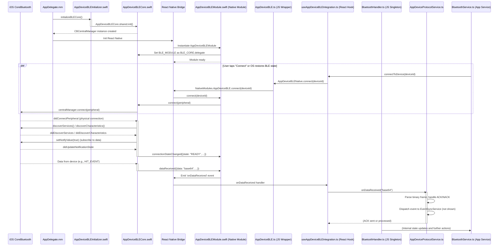
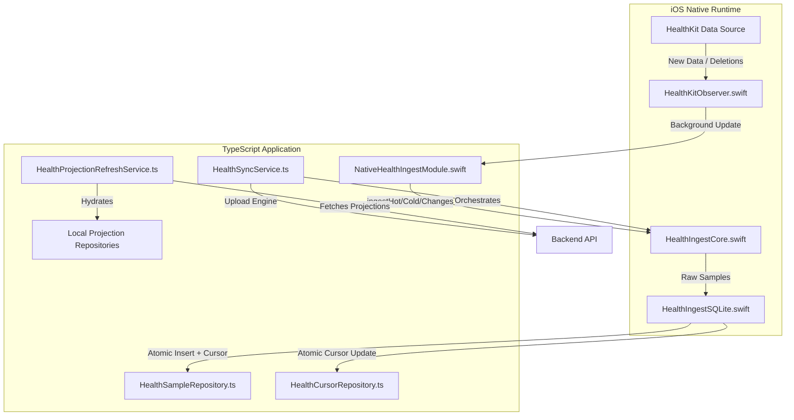

# Architecture

## Overview

This codebase represents the client-side platform for a local-first React Native application. It is architected around robust data ownership, resilient offline operation, and deep integration with platform-specific native capabilities. Key centers of gravity include its iOS-native runtime modules for sensitive OS interactions (BLE, HealthKit, secure reset), a SQLite-first local data model for responsive UI, and distinct, correctness-driven synchronization pipelines for entity and health data, all designed for resilience under various lifecycle, offline, and background constraints.

 

---

## Scope and Document Boundaries

This document serves as the architectural map for the app-side repository. It is intended for technically literate readers — including prospective contributors, technical reviewers, recruiters, and the repository owner — to quickly form a credible mental model of the system's structure, major components, and core operational flows.

**This document covers:**

*   The overall architectural structure of the app-side system
*   The boundaries and responsibilities of its major subsystems and layers
*   The source-of-truth and data ownership model
*   The startup orchestration and runtime composition
*   Major operational flows: BLE communication, health ingestion, entity synchronization, and app reset/recovery
*   Platform-specific architectural concerns (especially iOS-native depth)

Deeper implementation details, specific protocols, and exhaustive failure mode catalogs are explicitly delegated to sibling documents:

| Document | Focus Area |
| :--- | :--- |
| [**NATIVE-IOS-ANDROID-BLE.md**](./NATIVE-IOS-ANDROID-BLE.md) | BLE transport, protocols, and native integration |
| [**HEALTH-INGESTION.md**](./HEALTH-INGESTION.md) | HealthKit/Health Connect ingestion lanes, data normalization, and processing |
| [**OFFLINE-SYNC.md**](./OFFLINE-SYNC.md) | Transactional outbox, cursor-based pull, and integrity validation |
| [**DATA-FLOW.md**](./DATA-FLOW.md) | Data movement across layers and systems |
| [**FAILURE-MODES.md**](./FAILURE-MODES.md) | Failure modes, resilience strategies, and recovery procedures |
| [**decisions/**](./decisions/) | Architectural Decision Records (ADRs) documenting specific design choices |

---

## System at a Glance

The app-side system is best understood as a layered platform designed for reliability, responsiveness, and deep platform integration. It comprises a core React Native application that leverages native modules for performance- and lifecycle-critical tasks, backed by a local-first persistence model and specialized synchronization pipelines.

At its highest level, the architecture is composed of six distinct layers:

1.  **Native Runtime Layer (iOS-heavy):** Handles direct interactions with the operating system for critical functionalities like BLE (CoreBluetooth), HealthKit, and secure app lifecycle management (reinstall detection, factory reset). These components operate early in the app launch, often before the JavaScript environment is fully live, ensuring platform-level integrity and responsiveness.

2.  **Native Integration Bridge:** A thin TypeScript layer that exposes native module capabilities to the React Native application and translates native events into a JavaScript-consumable format. This layer ensures that native performance benefits are leveraged while maintaining JavaScript as the primary orchestration surface.

3.  **Composition Root and Startup Layer:** Orchestrates the initialization of all application services, repositories, and third-party integrations. It manages a phased startup sequence, prioritizing critical components for a fast "first paint" and handling background/deferred tasks asynchronously.

4.  **Application Services and Domain Orchestration:** The core TypeScript application logic, where complex business behaviors are composed. This layer coordinates interactions between local repositories, external API clients, and real-time services, abstracting data logic from the UI components.

5.  **Local Persistence and Repository Layer:** Manages the app's local data model using SQLite and Drizzle ORM. It provides a robust, offline-first data store for the UI, segmented into domain data, sync metadata (outbox, cursors, ID maps, tombstones), and health-specific repositories.

6.  **External System Boundaries:** Defines the interfaces and contracts for interacting with external systems, including BLE devices, HealthKit, a backend API, WebSocket infrastructure, and secure local storage.

Those layers interact in complex flows, where correctness and resilience are paramount. These interactions form the "centers of gravity" of the application architecture.

  

 

| Abbreviation | Layer | Key Components |
| :--- | :--- | :--- |
| **NRL** | Native Runtime Layer | `AppDeviceBLECore`, `HealthIngestCore`, `FactoryResetGuard`, `AppDelegate.mm` |
| **NIB** | Native Integration Bridge | `AppDeviceBLE.ts`, `useAppDeviceBLEIntegration.ts`, `NativeHealthIngestModule.swift` |
| **CRS** | Composition Root & Startup | `AppProvider.tsx`, `StartupOrchestrator.ts` |
| **ASDL** | Application Services & Domain | `DeviceService.ts`, `FrontendConsumptionService.ts`, `HealthSyncService.ts`, `BackendAPIClient.ts` |
| **LPRL** | Local Persistence & Repositories | `db/schema.ts`, `OutboxRepository.ts`, `HealthSampleRepository.ts` |
| **ESB** | External System Boundaries | Physical BLE Device, Apple HealthKit, Remote Backend, OS Lifecycle |

---

## Architectural Principles and Operating Constraints

The architectural design of this application is a direct response to a stringent set of principles and operational constraints inherent to modern mobile development, particularly for a health- and device-connected platform.

### Principles

*   **Local-First UI Responsiveness:** The user interface remains fully functional and highly responsive even when offline, leveraging a local SQLite database as the primary operational data store.

*   **Native Where Lifecycle/Performance Requires It:** Platform-sensitive functionalities (e.g., BLE state restoration, HealthKit background delivery, secure app reset) are implemented natively to meet strict OS lifecycle requirements, ensure real-time performance, and maintain security.

*   **Separation of Runtime-Sensitive Native Work from JS Orchestration:** Native modules handle low-level platform interactions and critical timing, while the React Native layer provides high-level orchestration, UI logic, and broader application flow. This prevents native constraints from blocking the JavaScript thread.

*   **Eventual Consistency with Explicit Correctness Checks:** Data synchronization with the backend is eventually consistent, relying on a transactional outbox, monotonic cursors, and a post-sync integrity gate to ensure data correctness and referential integrity, even under intermittent network conditions.

*   **Lifecycle-Safe Startup and Cleanup:** The application's initialization is phased and disciplined, prioritizing essential services for a fast user experience while offloading heavy tasks to background or deferred phases. Comprehensive cleanup mechanisms prevent resource leaks and ensure graceful shutdown.

*   **Platform-Sensitive Background Behavior:** Operations in the background (e.g., BLE reconnection, health ingestion) are carefully managed to respect OS execution limits, minimize battery drain, and ensure data delivery, leveraging native APIs for background task registration and state restoration.

### Operating Constraints

*   **iOS Background Execution Limits:** Strict time limits (typically <30 seconds for background tasks) for any processing initiated by OS events (e.g., HealthKit data changes, BLE state restoration).

*   **BLE Restoration Timing Constraints:** CoreBluetooth state restoration must occur extremely early in the app lifecycle, often before the React Native bridge is fully initialized, to capture `willRestoreState` events.

*   **High-Volume Health Ingestion:** Efficient processing of potentially large volumes of historical and real-time health data from HealthKit/Health Connect without blocking the UI or exceeding background execution limits.

*   **Intermittent Network Connectivity:** The app must remain functional offline and gracefully manage data synchronization when network availability is sporadic or completely absent.

*   **Reinstall / Keychain Persistence Hazards:** iOS Keychain data persists across app uninstallation. The app must detect reinstallation and perform a secure, multi-stage local data wipe to prevent crashes from stale authentication tokens or corrupted data.

---

## Layered System Model

### Native Runtime Layer (iOS-heavy)

**Responsibility:** Direct, low-level interaction with iOS system services for capabilities requiring precise timing, background execution, and security. It owns platform-sensitive connections and lifecycle hooks.

**Primary Components:**

*   `AppDelegate.mm`: The primary entry point for the native application lifecycle. It orchestrates early initialization routines for BLE, HealthKit, and secure app state management (reinstall detection, factory reset).
*   `AppDeviceBLECore.swift`: The singleton owner of `CBCentralManager` for CoreBluetooth interactions. It handles BLE connection states, state restoration (via `willRestoreState`), timeouts, and GATT pipeline error detection. It is the single source of truth for iOS BLE state.
*   `AppDeviceBLEInitializer.swift`: Ensures `AppDeviceBLECore` is initialized early in the app lifecycle, guaranteeing that `centralManager:willRestoreState:` is captured by the BLE core.
*   `HealthIngestCore.swift`: The core orchestrator for native HealthKit data ingestion. It manages three dedicated `OperationQueue`s (HOT, COLD, CHANGE) for different ingestion priorities, including robust cancellation and error handling.
*   `HealthIngestSQLite.swift`: A direct SQLite C API wrapper for native health data ingestion. It performs atomic inserts and cursor updates, crucial for crash safety during background ingestion.
*   `HealthKitObserver.swift`: Manages `HKObserverQuery` registration and background delivery from HealthKit. It ensures the app is woken up by iOS when health data changes, operating within strict background time limits.
*   `FactoryResetGuard.swift`, `ReinstallDetector.swift`, `KeychainWipeModule.swift`, `FactoryResetModule.swift`: Implement the secure multi-stage factory reset and reinstall detection logic. This ensures a clean state on app reinstallation by wiping Keychain and local data.

**Inbound/Outbound Dependencies:**

*   **Inbound:** `AppDelegate.mm` (lifecycle calls), React Native bridge (for specific actions like BLE scan/connect).
*   **Outbound:** `CoreBluetooth` (BLE), `HealthKit` (health data), `Security.framework` (Keychain), `UIKit` (OS lifecycle).

**What it should not own:** High-level application logic, UI state, business domain rules, network synchronization beyond basic API calls, or data transformations not directly related to platform data formats.

 

### Native Integration Bridge

**Responsibility:** Provides a thin, type-safe interface for React Native to interact with native modules and receive native events. It translates between JavaScript and native data types and ensures seamless communication.

**Primary Components:**

*   `AppDeviceBLEModule.swift`: The Objective-C bridge for `AppDeviceBLECore`, exposing its methods (`startScan`, `connect`, `write`, `disconnect`, `getConnectionState`) to JavaScript via `NativeModules`. It also acts as the delegate for `AppDeviceBLECore` events, forwarding them to the `RCTEventEmitter`.
*   `AppDeviceBLE.ts`: A TypeScript wrapper around `NativeModules.AppDeviceBLE`, providing type-safe method calls and event subscriptions (`onConnectionStateChange`, `onDataReceived`, `onBondingLost`). It handles the runtime availability of the native module.
*   `useAppDeviceBLEIntegration.ts`: A React hook that orchestrates the integration of `AppDeviceBLE.ts` with the existing `BluetoothHandler`. It listens to native events and updates the centralized `BluetoothHandler` state.
*   `NativeHealthIngestModule.swift`: The Objective-C bridge for `HealthIngestCore`, exposing its ingestion lane methods (`ingestHot`, `ingestCold`, `ingestChanges`) and status queries to JavaScript. It also registers for iOS background HealthKit updates.

**Inbound/Outbound Dependencies:**

*   **Inbound:** React Native application layer (via `NativeModules` calls), native runtime layer (delegation from `AppDeviceBLECore`, `HealthIngestCore`).
*   **Outbound:** React Native `EventEmitter` (for native events), TypeScript `BluetoothHandler` (for updating core BLE state), `HealthIngestCore` (for dispatching ingestion tasks).

**What it should not own:** Complex business logic, long-running operations (beyond forwarding), UI state, or core data persistence. It is purely a translation and communication layer.

 

### Composition Root and Startup Layer

**Responsibility:** Initializes and wires up all application services and repositories, forming the dependency graph for the entire app. It orchestrates the startup process, ensuring critical services are available promptly and heavy tasks are managed efficiently.

**Primary Components:**

*   `AppProvider.tsx`: The central React Context provider and composition root. It instantiates all singletons (repositories, domain services, sync services, monitoring, etc.) and makes them available via `useAppContext` hooks. This defines the app's entire runtime dependency graph.
*   `StartupOrchestrator.ts`: Divides app initialization into phased tasks (`CRITICAL`, `ESSENTIAL`, `BACKGROUND`, `DEFERRED`). It prioritizes tasks for perceived performance (fast first-paint) and manages concurrent execution, cleanup, and error handling.

**Inbound/Outbound Dependencies:**

*   **Inbound:** `main.m` (initial React Native boot), `AppDelegate.mm` (ensures early native init completes first).
*   **Outbound:** Instantiates ALL other application layers and services, effectively defining the entire dependency tree.

**What it should not own:** Business logic, data access, UI rendering (beyond loading screens), or any long-running operations itself (it orchestrates them).

---

## Native Runtime Architecture

The native runtime layer, predominantly on iOS, is a cornerstone of this application's architecture. It exists to address stringent OS requirements for performance, lifecycle management, and security that cannot be reliably met by the JavaScript layer alone.

### BLE Runtime Ownership and Restoration (iOS)

**Why Native:** `CoreBluetooth` requires early initialization and active management of `CBCentralManager` to support state restoration. If the app is terminated by the OS (e.g., due to memory pressure or a BLE event in the background), iOS can relaunch it specifically to restore the BLE session. The `centralManager:willRestoreState:` delegate method is called *before* the React Native bridge is fully active, demanding native-side handling.

**Components:**

*   `AppDelegate.mm`: Explicitly calls `[AppDeviceBLEInitializer initializeBLECore];` very early in `didFinishLaunchingWithOptions`. This ensures the `CBCentralManager` is created with a `CBCentralManagerOptionRestoreIdentifierKey` before iOS attempts state restoration.
*   `AppDeviceBLECore.swift`: Implements `CBCentralManagerDelegate` and `CBPeripheralDelegate`. It is designed as a singleton and is the sole owner of the `CBCentralManager` instance. It handles the `centralManager:willRestoreState:` callback, which re-establishes the connection and drives the full GATT discovery pipeline for any restored peripherals.
*   `BLETypes.swift`: Defines explicit `ConnectionState` and `DisconnectReason` enums. `EC-FAULT-001` specifies distinct GATT pipeline fault reasons, enabling granular error handling in the JS layer.

**Behavior:** The native BLE layer manages connection state, handles timeouts for various BLE operations (connect, discover, subscribe), and implements robust error classification for disconnect reasons (e.g., `bondingLost`, `encryptionFailed`, `deviceSleep`). This ensures the JS layer receives high-signal events for connection failures.

<strong>BLE Runtime Sequence Diagram</strong>

 

 

### Health Ingestion Runtime (iOS)

**Why Native:** HealthKit background delivery requires `HKObserverQuery` registration to occur *before* `applicationDidFinishLaunchingWithOptions` returns. If registered too late, background updates are silently never delivered by iOS. Additionally, high-volume data ingestion and atomic database transactions are more efficiently and reliably handled natively.

**Components:**

*   `AppDelegate.mm`: Explicitly calls `[[HealthKitObserver shared] registerDefaultObservers];` early in launch. This guarantees HealthKit observer registration within the OS's required timing window.
*   `HealthKitObserver.swift`: A singleton responsible for registering `HKObserverQuery` for relevant `HKSampleType`s and enabling `enableBackgroundDelivery`. It acts as a bridge, notifying the `NativeHealthIngestModule` (and subsequently the JS layer) when HealthKit data changes. It also feature-gates registration based on a `UserDefaults` flag.
*   `NativeHealthIngestModule.swift`: Bridges the `HealthIngestCore` to JavaScript. It also provides a critical `onBackgroundUpdate` callback handler for `HealthKitObserver`. This handler receives background HealthKit update notifications, triggers the `CHANGE` ingestion lane, and includes a hard timeout to ensure `completionHandler()` is called within the strict iOS background budget (typically 15 seconds), preventing app termination.
*   `HealthIngestCore.swift`: The core of native health ingestion. It manages three dedicated `OperationQueue`s for HOT, COLD, and CHANGE ingestion lanes, each with specific Quality of Service (QoS). It implements cancellation flags (`AtomicBool`) and handles HealthKit queries (`HKSampleQuery`, `HKAnchoredObjectQuery`) with timeouts.
*   `HealthIngestSQLite.swift`: Provides direct C API access to SQLite. It performs atomic inserts of normalized health samples and cursor updates of ingestion cursors within a single transaction. This is critical for crash safety: samples are only considered persisted if the cursor also advances. It uses `BEGIN IMMEDIATE` for robust locking and `changes()` for CAS verification.

**Behavior:** Native code handles the early registration, background wake-ups, and reliable, crash-safe ingestion of large volumes of health data directly from HealthKit, including monotonic cursor advancement and accurate metadata normalization.

<strong>Health Ingestion Data Flow</strong>

 

 

### Factory Reset and Reinstall Protection (iOS)

**Why Native:** iOS Keychain data persists across app uninstallation. If a user reinstalls the app, stale Keychain tokens (e.g., OAuth, device IDs) can cause crashes or security issues. Securely wiping these tokens and all other persistent app data (SQLite, AsyncStorage) requires direct OS-level operations.

**Components:**

*   `AppDelegate.mm`: `ReinstallDetector.checkForReinstall()` and `FactoryResetGuard` logic run as the *very first* operations in `didFinishLaunchingWithOptions`, *before* Firebase, React Native, or any other initialization.
*   `ReinstallDetector.swift`: Detects reinstallation by comparing a Keychain marker (persists across uninstall) with a sandbox sentinel file (deleted on uninstall). It also includes self-healing logic to re-seed markers if partially missing.
*   `FactoryResetGuard.swift`: Prevents infinite factory reset loops by tracking reset attempts per build number using `UserDefaults`. This ensures the app doesn't get stuck in a crash-on-reinstall cycle.
*   `KeychainWipeModule.swift`: Wipes *all* app-scoped Keychain items directly using `Security.framework` APIs. This is irreversible and targets auth tokens, device IDs, and other secure data.
*   `FactoryResetModule.swift`: Wipes the entire `Documents/SQLite` directory (including all databases and sidecar files) and the `RCTAsyncLocalStorage` directory. This ensures a complete local data wipe.

**Behavior:** This is a comprehensive, fail-fast, and retry-aware system-level design that ensures a clean slate on reinstallation, preventing data corruption and security vulnerabilities.

---

## Application Core and Service Boundaries

The JavaScript application layer is a sophisticated orchestration engine, built around a robust set of services and clear boundaries, rather than a thin UI wrapper.

### Service Categories

**BLE/Device Services:**

*   `DeviceService`: Manages device pairing, registration, status updates, and lifecycle with local-first persistence. It works with `LocalDeviceRepository` and `OutboxRepository`.
*   `BluetoothService`: Orchestrates the `BluetoothHandler` (which uses `AppDeviceBLENative` on iOS) for scanning, connecting, and data transfer. It integrates `EventSyncService` for protocol-level handshake and hit processing, and `DeviceSettingsService` for configuration.
*   `BLERestorationService`: Manages device reconnection strategies, leveraging stored device IDs and reacting to native BLE restoration events.

**Domain/Frontend Services:**

*   `FrontendConsumptionService`, `FrontendSessionService`, `FrontendJournalService`, `FrontendProductService`: These implement the core business logic and workflows for consuming data, managing sessions, journaling, and product management in an offline-first manner. They orchestrate interactions between local repositories and the outbox.
*   `ActiveProductService`, `ProductSearchService`, `CatalogStateService`: Support product discovery, search, and selection, leveraging FTS5 capabilities for fast local search.
*   `ProductCatalogCoordinator`: Orchestrates the synchronization of the product catalog, handling versioning and updates.

**Health Services:**

*   `HealthKitService`: A robust, SOLID-compliant wrapper around `@kingstinct/react-native-healthkit`, providing type-safe access to iOS HealthKit data and managing permissions.
*   `HealthSyncService`: A separate, dedicated pipeline for syncing health data. It orchestrates native ingestion, upload to the backend, and refresh of local health projections (`HealthProjectionRefreshService`).
*   `HealthProjectionRefreshService`: Manages the local caching of server-computed health projections (rollups, sleep summaries, session impacts). It uses a dirty-key mechanism to trigger hydration when local health samples change.

**API Clients:**

*   `BackendAPIClient`: A robust, observable API client with JWT refresh, retry, rate limiting, and clock skew handling.
*   `AIAPIClient`, `UnifiedAPIService`: Integrate with specific backend API endpoints for AI functionalities and unified API access.

**Realtime Services:**

*   `WebSocketClient`: Manages the Socket.IO connection for real-time event notifications from the backend. It integrates with `DataSyncService` for triggering syncs on reconnect and `QueryClient` for automatic cache invalidation.

**Monitoring Services:**

*   `MonitoringService`: A facade that unifies error tracking (Sentry), analytics (Firebase Analytics), session replay (Clarity), and performance monitoring (Firebase Performance).

**Setup/Auth/Config Services:**

*   `AppSetupService`: Handles initial app setup, database initialization, migrations, and local data seeding.
*   `BackendAuthService`, `GoogleAuthService`, `PhoneAuthService`: Manage user authentication, JWT lifecycle, and user session state.

### Orchestration Role

These services coordinate complex flows by:

*   **Using Repositories:** Abstracting direct database access, performing CRUD operations on local data.
*   **Interacting with Native Adapters:** Leveraging native modules for platform-specific capabilities (e.g., BLE, HealthKit).
*   **Communicating with External Clients:** Making API calls via `BackendAPIClient`, receiving real-time updates via `WebSocketClient`.
*   **Emitting Events:** Using a global `EventEmitter` (`dataChangeEmitter`) to decouple concerns and trigger UI updates or background processes.

### Screen and Hook Boundaries

*   **Should Own:** Presentational logic, UI state relevant only to the screen, user input handling, and calling methods on application services.
*   **Should NOT Own:** Direct database queries, API calls, complex business rules, data transformation logic, sync orchestration, or platform-specific runtime behaviors (delegated to native modules).

> UI components are primarily *consumers* of the domain layer, not owners of data logic. This separation ensures maintainability, testability, and a clear architectural boundary.

---

## Local Data Model and Ownership

The local data model is a cornerstone of the app's offline-first architecture, ensuring UI responsiveness and reliable operation even without network connectivity.

### SQLite + Drizzle

*   The application leverages **SQLite** as its embedded local database for high performance and reliability on mobile devices.
*   **Drizzle ORM** provides a type-safe, SQL-like query builder over SQLite. It maps database tables to TypeScript schemas (`db/schema.ts`) and infers types for `Db*` rows and `Db*Insert` inputs, ensuring compile-time validation of database operations.

### Repository Boundaries

*   All interactions with the database are encapsulated within **repositories** (`packages/app/code-snippets/repositories/`). This abstraction layer ensures that underlying database implementation details (e.g., raw SQL, Drizzle syntax) are hidden from application services.
*   Repositories are injected into services, following the Dependency Inversion Principle.

### Local Database as UI Source of Truth

For the UI, the local SQLite database is the **primary operational source of truth**. This means that when the user performs an action (e.g., logging a consumption offline), the UI updates instantly from the local database, not by waiting for a backend roundtrip. The backend is the **eventual consistency counterpart** for synced entity data, not the direct query layer for the UI.

This design enables:

*   **Offline Functionality:** The app remains fully functional without network.
*   **Instant UI Updates:** Actions appear immediate to the user.
*   **Optimistic Updates:** UI can reflect changes even before they are committed to the backend.

### Data Categories

The local database segregates data into three distinct categories, each with its own repositories and sync patterns:

**1. Domain Data (Synced Entities)**

*   Repositories: `LocalSessionRepository`, `LocalJournalRepository`, `LocalDeviceRepository`, `LocalProductRepository`, etc. (using Drizzle).
*   Contains: User-created content (sessions, journal entries), purchased items, device registrations.
*   Sync Mechanism: Transactional outbox (for local-first writes) and cursor-based pull (for server-initiated changes).

**2. Sync Metadata (Offline Infrastructure)**

*   Repositories: `OutboxRepository`, `CursorRepository`, `IdMapRepository`, `TombstoneRepository`. These are the core infrastructure for the local-first sync pattern.
*   `OutboxRepository`: Stores pending local mutations as discrete commands. It is a large, core component that handles command deduplication (merging multiple updates for the same entity) and retry management.
*   `CursorRepository`: Tracks cursor positions for each entity type, enabling incremental pull synchronization. It enforces monotonic cursor advancement.
*   `IdMapRepository`: Maintains mappings between client-generated UUIDs (for offline creation) and server-assigned UUIDs (after successful push).
*   `TombstoneRepository`: Records soft-deleted entities that need to be synchronized with the backend.

**3. Health Data (Separate Pipeline)**

*   Repositories: `HealthSampleRepository`, `HealthCursorRepository`, `HealthDeletionQueueRepository`, `LocalHealthRollupRepository`, etc.
*   Contains: Raw health samples (heart rate, steps, sleep) from HealthKit/Health Connect, ingestion cursors, and local caches of server-computed health projections.
*   Sync Mechanism: A separate, push-only pipeline with its own retry logic and crash recovery. It uses opaque HealthKit anchors and performs atomic `insert-plus-cursor-update` operations (`HealthSampleRepository`).

### Architectural Infrastructure

ID Maps, Tombstones, Cursors, and Deletion Queues are not merely incidental boilerplate; they are foundational to the app's local-first and eventual consistency guarantees:

*   **ID Maps:** Critical for bridging client-generated UUIDs (created offline) to server-assigned UUIDs, ensuring referential integrity and correct updates during sync.
*   **Tombstones:** Enable robust soft-deletion. When a record is deleted locally, it's marked as deleted (tombstoned) rather than permanently removed, ensuring the deletion is eventually propagated to the backend.
*   **Cursors:** Provide efficient incremental synchronization. By tracking the last-synced position per entity, only new or changed data needs to be exchanged with the server.
*   **Deletion Queues:** For health data, a dedicated queue ensures that deletions reported by the OS (HealthKit) are reliably propagated to the server, preventing data resurrection.

 

| Data Class | Local Source of Truth | Upstream Source | Sync Mechanism | Primary Consumers |
| :--- | :--- | :--- | :--- | :--- |
| **Domain Entities** | `SQLite` (`Local*Repository`) | Backend REST API | Entity Sync (Outbox, Cursor, IdMap) | UI Components |
| **Auth Tokens** | `SecureStorageService` | Backend Auth Service | JWT Refresh (BackendAPIClient) | `BackendAPIClient` |
| **Device Settings** | `SQLite` (`LocalDeviceRepository`) | BLE Device / Backend API | Entity Sync / BLE Config Protocol | UI, `BluetoothService` |
| **Health Samples** | `SQLite` (`HealthSampleRepository`) | HealthKit / Health Connect | Health Sync (Push-only, Deletion Queue) | Health Insights, UI |
| **Health Projections** | `SQLite` (`Local*ProjectionRepository`) | Backend Projection API | Health Sync (Pull-only, Dirty Key Refresh) | UI (Charts, Dashboards) |
| **Sync Metadata** | `SQLite` (`OutboxRepository`, `CursorRepository`) | Backend Sync API / Client state | Internal (managed by `DataSyncService`) | `DataSyncService` |

---

## Synchronization Architecture

Data synchronization is one of the highest-signal subsystems in this repository, embodying a local-first, correctness-driven approach. It is explicitly separated into two distinct pipelines: **Entity Sync** and **Health Sync**.

### Entity Sync Pipeline

This pipeline (`DataSyncService.ts`) handles user-generated data (consumptions, sessions, products, etc.) and guarantees eventual consistency with the backend.

  

 

#### Outbox Writes

Local writes and mutations (CREATE, UPDATE, DELETE) are first persisted to the local SQLite database for immediate UI responsiveness. Simultaneously, these operations are recorded as discrete commands in the `OutboxRepository` (the transactional outbox pattern). This ensures that local changes are durably stored and queued for eventual upload, even if the app is offline or crashes.

`OutboxRepository` is a large, core component that handles command deduplication (merging multiple updates for the same entity) and retry management.

> **Guarantee:** A local change is never committed without a corresponding outbox entry. No mutation is silently lost.

#### Push / Pull / Apply

The `SyncCoordinator` orchestrates the entire sync process, which typically involves a **Push** phase followed by a **Pull** phase.

**Push Engine (`PushEngine.ts`):**

*   Dequeues actionable commands (PENDING or retry-eligible FAILED) from the `OutboxRepository`.
*   Resolves client-generated IDs within payloads to server-assigned IDs using `IdMapRepository` and dependency-aware FK resolution (`PushEngineCore.ts`).
*   Orders commands by type (CREATE then UPDATE then DELETE) and entity dependency (parents before children) to prevent foreign key violations on the backend.
*   Constructs a batched HTTP request (including a `requestId` and `payloadHash` for server-side idempotency).
*   Sends the batch to the backend's `/sync/push` endpoint.
*   Processes the server response, marking successful commands as `COMPLETED` in the outbox, updating `IdMapRepository` with new client-to-server ID mappings, and marking failed commands for retry (`FAILED`) or permanent rejection (`DEAD_LETTER`).
*   Pushes `TombstoneRepository` entries (for deletions) similarly.

**Pull Engine (`PullEngine.ts`):**

*   Constructs a "composite cursor" (`@shared/contracts/cursor.ts`) from the latest `EntityCursor` for each entity type stored in `CursorRepository`. This allows efficient delta fetching for all entities in one API call.
*   Sends a GET request to the backend's `/sync/changes` endpoint, including the composite cursor.
*   Fetches changes incrementally, repeating calls if `hasMore` is true.
*   Delegates received changes (CREATE, UPDATE, DELETE) to the `ApplyEngine` for local application.

> **Critical:** Cursor updates are *deferred* to a `SyncBatchContext`, only committed by the `SyncCoordinator` after `IntegrityGate` passes. Cursors only advance if data is safely applied locally AND integrity is maintained.

**Apply Engine (`ApplyEngine.ts`):**

*   Applies individual changes (CREATE, UPDATE, DELETE) received from the `PullEngine` to the local SQLite database.
*   Uses `FrontendSyncHandlerRegistry` to dispatch to entity-specific handlers (`GenericSyncHandler` or custom merges).
*   Tracks all touched entities (inserted, updated, deleted) in the `SyncBatchContext` for the `IntegrityGate`.
*   Handles conflict resolution for incoming changes.

#### Cursor Advancement

`CursorRepository` stores per-entity cursors. These cursors (`EntityCursor`) are composite keys (lastCreatedAt, lastId) for deterministic, monotonic advancement.

The `SyncCoordinator` orchestrates cursor updates. It only commits new cursor positions (via `CursorRepository.setMultipleCursors()`) if the preceding `IntegrityGate` checks pass. This is crucial for at-least-once delivery semantics.

#### Integrity Gate

After changes are applied (both push responses and pull data), the `IntegrityGate` performs a post-sync validation step.

*   It uses the `RELATION_GRAPH` (`@shared/contracts`) as the single source of truth for all foreign key relationships.
*   It detects **orphaned foreign key references** (e.g., a consumption referring to a product that doesn't exist locally) by querying the local SQLite database.
*   It uses `touchedIds` (IDs modified in the current sync batch) for scoped and efficient checks, avoiding expensive full-table scans.
*   It can operate in "warn-only" or "fail-fast" mode (throwing `IntegrityViolationError` on detection), ensuring data corruption is surfaced early.

> **Guarantee:** Cursors are NOT advanced if the `IntegrityGate` detects violations in fail-fast mode. Data integrity is enforced structurally, not by convention.

#### Conflict Handling

Conflicts (e.g., local updates to an entity already modified on the server) are detected by the `PushEngine`.

*   The `FrontendSyncHandlerRegistry` dispatches to entity-specific handlers (`GenericSyncHandler.ts`) which implement merge policies (`@shared/contracts/conflict-strategies.ts`).
*   Policies: `SERVER_WINS`, `LOCAL_WINS`, `LAST_WRITE_WINS`, `MERGE_ARRAYS` (for JSONB), `MONOTONIC` (for state transitions).
*   Unresolvable conflicts are placed in a dead-letter queue for manual user intervention.

#### Startup and Network Coordination

`DataSyncService.ts` manages the lifecycle and scheduling of entity sync:

*   Manages periodic sync intervals (dynamic based on app foreground/background state).
*   Listens to network connectivity changes (triggers sync on reconnect).
*   Implements exponential backoff for rate-limit errors and transient server failures.
*   Applies a per-source cooldown to prevent sync storms from multiple triggers.
*   Coordinates with `SyncScheduler` to run syncs as prioritized background tasks, respecting CPU/network budgets.

#### Realtime Notifications

*   `WebSocketClient.ts` listens for real-time events from the backend (e.g., `consumption.created`, `session.updated`).
*   On receiving an event, it first attempts to directly patch the `React Query` cache (`setQueryData`).
*   If patching fails or is not applicable (e.g., for `_deleted` events), it invalidates relevant `React Query` keys (`invalidateQueries`) to trigger a fresh fetch from the local repository on next access.
*   WebSocket reconnect events trigger a `performFullSync()` to ensure any missed events or offline changes are reconciled.

 

### Health Ingestion and Health Sync Architecture

Health data management (`HealthSyncService.ts`) is an entirely separate pipeline from the main entity sync. This separation is crucial due to the unique characteristics of health data: it is typically push-only (device-to-server), high-volume, and has specific OS-level ingestion requirements.

#### HealthKit / Health Connect as Upstream Source

*   The primary data source is either iOS HealthKit or (on Android) Google Health Connect.
*   Native modules (`HealthIngestCore.swift`) handle the raw data acquisition via `HKObserverQuery`s and `HKSampleQuery`s.

#### Native Ingestion Lanes

`HealthIngestCore.swift` implements three dedicated ingestion lanes, each with its own `OperationQueue` and Quality of Service (QoS):

*   **HOT Lane** (`userInitiated`): Queries recent data for immediate UI updates. Uses a sliding window with per-metric watermarks and includes a two-pass strategy (first-paint then catch-up) for responsiveness after user absence. Includes query limits and robust timeouts.
*   **COLD Lane** (`utility`): Processes historical data in time-cursor chunks, walking backward to fill a 90-day backfill window. Implements dynamic per-metric chunk reservation and cross-invocation fairness.
*   **CHANGE Lane** (`default`): Uses `HKAnchoredObjectQuery` to detect additions and deletions since the last anchor. This is triggered by both active app use and background HealthKit delivery notifications. It is crucial for propagating deletions from the source.

Robust cancellation flags (`AtomicBool`) exist for each lane to prevent orphaned native work, especially when the JS bridge times out.

#### Atomic Local Persistence + Cursor Advancement

*   `HealthSampleRepository.ts` stores normalized health samples in SQLite (`health_samples` table). It performs `INSERT ... ON CONFLICT DO UPDATE` for idempotent upserts and handles soft deletes (setting `isDeleted = true`).
*   `HealthCursorRepository.ts` stores opaque HealthKit/Health Connect anchors or time-based cursors in `health_ingest_cursors` table. It uses optimistic concurrency (`cursorVersion`) for crash safety.

> **Guarantee:** Ingestion (`HealthIngestCore`) performs an **atomic `insertSamplesAndUpdateCursorAtomic()`** operation. Samples are only persisted if their corresponding cursor is also updated in the *same SQLite transaction*. This prevents data loss from crashes between insertion and cursor advancement.

#### Upload Pipeline

*   `HealthDeletionQueueRepository.ts` stores soft-deleted health samples for server propagation. It supports dual-mode deletion (precise with timestamp, or lossless if timestamp unknown) and uses retry logic.
*   `HealthUploadEngine.ts` (orchestrated by `HealthSyncService`) stages pending `HealthSampleRepository` entries and `HealthDeletionQueueRepository` entries.
*   It forms batches (with `requestId` and `payloadHash` for idempotency) and uploads them to the backend's `/health/samples/batch` endpoint.
*   It manages retry logic (exponential backoff) and crash recovery for stuck uploads.

#### Projection Refresh

`HealthProjectionRefreshService.ts` orchestrates the hydration of local read models (projections) from the backend API.

*   Repositories like `LocalHealthRollupRepository`, `LocalSleepNightSummaryRepository`, `LocalSessionImpactRepository`, `LocalProductImpactRepository`, and `LocalHealthInsightRepository` store cached server-computed aggregates.
*   `LocalRollupDirtyKeyRepository` and `LocalSleepDirtyNightRepository` act as dirty-key queues. When new samples are ingested, dirty keys are enqueued, triggering the `HealthProjectionRefreshService` to fetch fresh projections from the backend.
*   The hydration process uses optimistic concurrency and reconciliation rules (e.g., higher `computeVersion` or `sourceWatermark` wins) to prevent overwriting newer local projections with older server data. It performs atomic upsert-and-prune operations to keep local caches consistent with the server's authoritative view.

#### Why Health Sync is Separate from Entity Sync

*   **Data Volume/Velocity:** Health data can be extremely high volume and high frequency (e.g., heart rate every minute), making it unsuitable for the slower, more complex entity sync pipeline (which handles transactional business entities).
*   **Data Semantics:** Health data is typically append-only or uses soft-deletes; it doesn't have complex merge conflicts like business entities.
*   **OS Integration:** Health data ingestion is tightly coupled with platform-specific APIs and background processing.
*   **Performance:** A dedicated, optimized pipeline minimizes overhead and prevents contention with the main entity sync.

---

## BLE and Device Communication Architecture

BLE communication with App Device devices is a first-class architectural concern, designed for resilience, correctness, and deep integration with the iOS platform.

### Native iOS Transport Ownership

`AppDeviceBLECore.swift` is the **singleton source of truth** for `CBCentralManager` on iOS. It directly manages the CoreBluetooth stack.

*   It handles low-level details: `CBCentralManagerDelegate` and `CBPeripheralDelegate` callbacks, connection state machine, GATT discovery, MTU negotiation, and raw data transfer.
*   **State Restoration (`willRestoreState`):** `AppDeviceBLECore` is specifically designed to handle iOS's background BLE state restoration. It ensures that if the app is terminated and later relaunched due to a BLE event, the connection is seamlessly re-established at the native layer, before the JavaScript environment is fully alive. This guarantees continuous connectivity.
*   **Robust Error Classification:** It explicitly classifies BLE disconnect reasons (e.g., `bondingLost`, `encryptionFailed`, `timeout`, `deviceSleep`, `serviceNotFound`, `subscriptionFailed`) via `DisconnectReason` enum. This high-signal error information allows the JavaScript layer to implement sophisticated recovery strategies (e.g., prompt for re-pairing, intelligent retry backoff).

### JavaScript Bluetooth Orchestration

The JavaScript `BluetoothService` provides the high-level orchestration for BLE interactions. It wraps the `BluetoothHandler` (which in turn uses `AppDeviceBLENative` on iOS) and manages the application-level BLE state.

*   It handles scanning, connection attempts, reconnection logic, and routing of device data.
*   It ensures user-facing actions (e.g., "Connect," "Disconnect") are properly translated into native commands.

### Protocol Services

`AppDeviceProtocolService.ts` manages the APP DEVICE binary protocol layer:

*   **Frame Building/Parsing:** Encoding/decoding binary frames (`BinaryProtocol.ts`).
*   **ACK/NACK Handling:** Reliable message delivery with retries and sequence numbers.
*   **Event Deduplication:** Prevents processing duplicate events (`eventId`).
*   **Time Synchronization:** Establishes a time anchor with the device for accurate timestamp conversion (`EventSyncService.ts`).

### Restoration Service

`BLERestorationService.ts` works in conjunction with the native BLE layer to ensure robust reconnection after app termination or background events. It stores known device IDs and initiates reconnection attempts, often after the native layer has handled initial state restoration.

### Device Service Responsibility Split

*   `DeviceService.ts` (application layer): Manages the persistence and business logic for `Device` entities (pairing, removal, status updates). It's offline-first and integrates with the `OutboxRepository` for syncing device changes.
*   `AppDeviceBLECore.swift` (native layer): Handles the low-level physical connection and GATT operations.

### Native Event Flow into JavaScript

Native events from `AppDeviceBLECore` (e.g., `connectionStateChanged`, `dataReceived`, `bondingLost`) are emitted via `RCTEventEmitter` through `AppDeviceBLEModule.swift`.

1.  The `useAppDeviceBLEIntegration.ts` hook subscribes to these native events.
2.  This hook forwards the events to the centralized `BluetoothHandler` (TypeScript singleton).
3.  The `BluetoothHandler` updates its internal state (connection state, discovered devices), which is then consumed by `BluetoothService` and other application services.
4.  Raw data events (`onDataReceived`) are passed to `AppDeviceProtocolService` for binary protocol parsing and dispatch.

> **Guarantee:** The application's JavaScript state is always synchronized with the authoritative native BLE state. BLE connections survive app termination. Native events are buffered until the JS bridge is ready. No events are silently dropped.

---

## External Boundaries and Trust Boundaries

The application operates within a complex ecosystem of external systems. Defining clear boundaries and explicit trust relationships is critical for security, reliability, and maintainability.

### BLE Peripheral / Device (App Device Devices)

*   **Provides:** Sensor readings, device status, battery level, configuration capabilities, firmware version.
*   **App Assumes:** Device firmware adheres to the App Device binary protocol, includes hardware identifiers (MAC address) for stable device identification, and performs security (bonding/encryption).
*   **App Validates/Coordinates Locally:** Protocol version, CRC integrity of frames, message sequence numbers, ACK/NACK for reliable delivery, device ID (MAC address), GATT service/characteristic UUIDs, MTU negotiation, bonding status (`onBondingLost` event).

### HealthKit / OS Health APIs (iOS)

*   **Provides:** Raw health samples (`HKSample`), deletion notifications (`HKAnchoredObjectQuery`), background updates (`HKObserverQuery`), authorization status.
*   **App Assumes:** User grants necessary permissions, HealthKit is available, data formats conform to Apple's specifications.
*   **App Validates/Coordinates Locally:** HealthKit authorization status, metric code canonicalization, unit normalization, value bounds, timezone offsets, background delivery timing constraints (strict 15-30s window), atomic persistence of samples and cursors.

### Backend REST API

*   **Provides:** Canonical entity data (user profiles, products, consumptions), sync cursors, authentication tokens (JWTs), feature flags, configuration.
*   **App Assumes:** Backend implements defined DTOs, uses JWT for authentication, handles request-level idempotency (via `requestId` and `payloadHash` headers), provides clear error codes (401, 409, 429), and supports `Accept-Encoding: gzip`.
*   **App Validates/Coordinates Locally:** JWT lifecycle (refresh, expiry), API response schema validation, idempotency hash matching, retry logic with exponential backoff, rate limit awareness (using `Retry-After` header), clock skew calculation (`Server-Time` header), request/response data logging.

### WebSocket Notification Channel (Socket.IO)

*   **Provides:** Real-time push notifications from the backend when entity data changes.
*   **App Assumes:** Server pushes validated, tenant-scoped events (event `userId` matches connected `userId`).
*   **App Validates/Coordinates Locally:** JWT authentication in handshake, incoming event schema validation (Zod), tenancy validation (event `userId` matches `AuthContext.userId`), `React Query` cache invalidation, reconnect logic, network state awareness.

### Secure Storage / Keychain / AsyncStorage

*   **Provides:** Persistent, encrypted storage for sensitive data (auth tokens, device IDs, user preferences, sync state, feature flags). Keychain is for sensitive data (iOS), AsyncStorage for less sensitive.
*   **App Assumes:** OS provides secure storage primitives (Keychain, Android Keystore).
*   **App Validates/Coordinates Locally:** Data sensitivity levels (`DataSensitivity`), iOS Keychain accessibility options (`AFTER_FIRST_UNLOCK` for background access), Android Keystore, migration from legacy AsyncStorage to `SecureStorageService`.

### OS Lifecycle / App State / Background Execution

*   **Provides:** App lifecycle events (app launch, foreground, background, termination), system background task hooks, crash reporting hooks.
*   **App Assumes:** The app's `Info.plist` includes necessary background modes (`bluetooth-central`, `fetch`, `processing`).
*   **App Validates/Coordinates Locally:** Reinstall detection on launch, graceful handling of app state transitions, background task registration (`BackgroundBLEManager`), adherence to system energy/resource limits, `StartupOrchestrator` phases.

---

## Reliability Posture and Failure Containment

Reliability is a first-class architectural concern, not an afterthought. The system is designed with multiple layers of failure containment and self-healing mechanisms to ensure data integrity and user experience even in adverse conditions.

### Reinstall Recovery (iOS)

*   `ReinstallDetector` and `FactoryResetGuard` in `AppDelegate.mm` proactively detect app reinstallation (Keychain marker + missing sandbox sentinel).
*   A **multi-stage local wipe flow** (Keychain → SQLite → AsyncStorage, using native modules) ensures all stale state is purged before normal app startup.
*   `FactoryResetGuard` prevents infinite wipe loops by limiting attempts per build version.

### Startup Gating and Phased Initialization

*   `StartupOrchestrator` divides initialization into `CRITICAL`, `ESSENTIAL`, `BACKGROUND`, and `DEFERRED` phases.
*   Heavy or non-critical tasks are deferred until after the UI's first paint, preventing startup freezes.
*   `DataSyncService` and `HealthSyncService` initialization is gated, preventing sync activity before essential services are ready or before the app is authenticated.

### Atomic Ingest and Cursor Advancement (Health Data)

`HealthSampleRepository.ts`'s `atomicInsertAndUpdateCursor()` method ensures that health samples are only persisted if their corresponding ingestion cursor is also updated in the **same SQLite transaction**.

> **Guarantee:** This prevents data loss from crashes between insertion and cursor advancement (cursor moves, but samples not saved, leading to skipped data).

### Outbox Durability (Entity Sync)

*   Local writes go to the `OutboxRepository` in an atomic transaction with local data updates (`FrontendConsumptionService`). If the outbox enqueue fails, the local data write rolls back.
*   This guarantees that any local change is durably recorded for eventual sync.
*   `OutboxRepository` itself manages retries with exponential backoff and moves retry-exhausted commands to a `DEAD_LETTER` queue for manual inspection.

### Cursor Monotonicity (Entity Sync)

*   `CursorRepository` (`@shared/contracts/cursor.ts`) enforces monotonic advancement: cursors (`lastCreatedAt`, `lastId`) can only move forward or stay the same.
*   Attempting to set a cursor backward throws a `CursorBackwardError`, preventing accidental re-processing or skipping of data due to logic bugs.

> **Guarantee:** `SyncCoordinator` commits deferred cursors *only if* the `IntegrityGate` passes.

### Integrity Gate

A post-sync validation layer that detects orphaned foreign key references (data corruption) in the local SQLite database.

*   By default, it operates in a "fail-fast" mode (configurable), throwing `IntegrityViolationError` if required FKs are orphaned. This forces early detection and resolution of data integrity issues.
*   It checks specific "touched" IDs from the current sync batch for efficiency, or runs a full check if needed.

### Cleanup of Long-Lived Services

*   `AppProvider`'s `useEffect` cleanup ensures that `DataSyncService`, `HealthSyncService`, `BluetoothService`, and `WebSocketClient` are properly `cleanup()` / `reset()` on component unmount or re-initialization.
*   This prevents memory leaks, orphaned background timers, and duplicated event listeners, especially vital during React Native Hot Reloading.

### Explicit Platform Constraints

*   Strict timeouts are enforced for native operations (e.g., HealthKit queries, BLE connections) to prevent indefinite blocking and ensure adherence to OS background execution limits.
*   Error handling explicitly differentiates between retryable (e.g., network timeout, 429 rate limit) and non-retryable (e.g., 400 validation error, 401 unauthorized) failures, enabling intelligent retry strategies.

---

## Verification and Evolution

The architecture is supported by extensive testing and is designed for maintainable evolution.

### Strong Test Coverage

The repository demonstrates a non-trivial verification surface:

*   **iOS Native Code:** Unit tests cover `HealthIngestCore` behavior, `ReinstallDetector` logic, and `AppDeviceBLECore` state transitions.
*   **Health Ingestion Pipelines:** Tests verify ingestion engines, atomic persistence, and cursor advancement.
*   **Sync System:** Comprehensive tests for sync handler registries, sync kernels, `IntegrityGate` logic, and all offline repositories (`OutboxRepository`, `CursorRepository`, `IdMapRepository`, `TombstoneRepository`).
*   **Startup Orchestration:** Tests validate phased startup, task execution order, and error handling.
*   **BLE OTA State:** Tests cover the OTA state machine and pre/post-update verification logic.
*   **Repository Behavior:** Extensive tests ensure `Drizzle ORM` queries, mappings, and CRUD operations behave as expected.

### Stable Areas

The core local-first data model (SQLite/Drizzle), the transactional outbox (`OutboxRepository`), cursor-based entity sync (`DataSyncService`), and the native iOS runtime for BLE/HealthKit are well-established and heavily tested. The `FrontendSyncHandlerRegistry` and `GenericSyncHandler` are also considered stable due to extensive testing and config-driven design.

### Evolving / Inferred Areas

*   **Android-native Depth:** The codebase evidence is much stronger for iOS-native runtime depth than for Android-native custom systems. While `BluetoothHandler` has a `shouldUseNativeTransport()` check, a robust Android native layer comparable to iOS's for BLE or Health Connect is **not explicitly present** in the provided files. The document reflects this honestly and avoids claiming symmetry unless code proof is added. Android would currently fall back to `react-native-ble-plx` or standard SDKs.
*   **Health Projection Read Models:** While the pipeline (`HealthProjectionRefreshService`) exists, the exact boundaries and content of every health projection/read model are evolving as more insights are built out. The architecture provides the framework, but specific projections may change.

---

## Related Documents

This document serves as the entry point to a more extensive documentation set. For deep dives into specific subsystems, refer to the following:

| Document | Focus Area |
| :--- | :--- |
| [**NATIVE-IOS-ANDROID-BLE.md**](./NATIVE-IOS-ANDROID-BLE.md) | BLE communication, protocols, and native platform specifics |
| [**HEALTH-INGESTION.md**](./HEALTH-INGESTION.md) | Health data ingestion from HealthKit/Health Connect, native lanes, and processing |
| [**OFFLINE-SYNC.md**](./OFFLINE-SYNC.md) | Local-first synchronization: outbox, cursors, ID maps, and integrity validation |
| [**DATA-FLOW.md**](./DATA-FLOW.md) | Data movement across layers and systems |
| [**FAILURE-MODES.md**](./FAILURE-MODES.md) | Failure modes, resilience strategies, and recovery procedures |
| [**decisions/**](./decisions/) | Architectural Decision Records (ADRs) documenting specific design choices |
