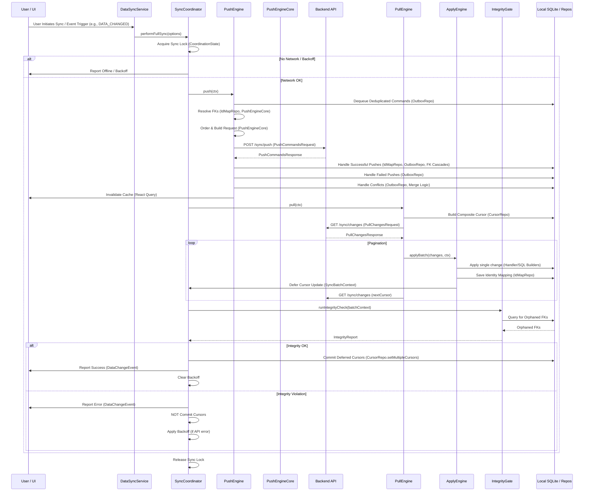
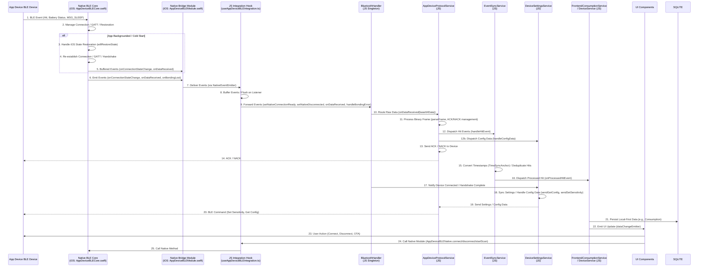

# Data Flow

This document maps how data originates, transforms, persists, and propagates through the AppPlatform mobile application. It synthesizes the app's multi-source, local-first architecture with robust native integration and comprehensive synchronization mechanisms.

<br>

## Overview

The AppPlatform app operates with a sophisticated, multi-source, local-first data architecture. It features distinct, often parallel, pipelines for various data types, including user-generated entities, device telemetry, and health data. Core paradigms include local-first mutations, robust synchronization, deep native integration, and efficient local read models.

## Scope and Boundaries

This document focuses on the *movement* and *lifecycle* of data within the app-side system. It covers data origination, transformations, persistence layers (local SQLite, SecureStorage), cross-bridge handoffs (Native-JS), synchronization mechanisms, and final presentation in the UI.

-   **Covered**: Major data flow pipelines, data ownership models, synchronization strategies, native integration points, data integrity guarantees, and UI freshness mechanisms.
-   **Excluded**: Detailed protocol specifications (e.g., BLE binary framing), exhaustive conflict resolution matrices (detailed merge logic beyond high-level strategy), and comprehensive bug history. These are deferred to specialized documents like `offline-sync.md`, `health-ingestion.md`, `nativeBLE.md`, and `failure-modes.md`.

---

## Data Ownership Model

Understanding data flow requires clarity on which system or layer is the "source of truth" for different data categories.

| Data Category | Primary Origin | First Durable Store | Sync Mechanism | UI Read Path | Authoritative Source |
| :--- | :--- | :--- | :--- | :--- | :--- |
| **Domain Entities** | User Input (UI) | Local SQLite (`Local*Repository`) | Transactional Outbox → Push/Pull Sync | React Query (`Local*Repository`) | Backend API (after sync) |
| **Health Data** | HealthKit / Health Connect | Local SQLite (`HealthSampleRepository`) | Health Upload Engine → Backend API | React Query (`HealthSampleRepository`) | Backend API (after upload) |
| **Device Telemetry** | App Device BLE Device | Native Runtime (transient) | JS Integration → Frontend Service → SQLite | React Query (`BluetoothHandler`) | BLE Device / Backend API |
| **Derived Projections** | Backend API (computed) | Local SQLite (`LocalHealthRollupRepo`) | Pull Sync (Hydration Client) | React Query (`Local*Repo`) | Backend API (after hydration) |
| **User Profile / Settings** | User Input / Backend API | Local SecureStorage / SQLite | Direct API Calls / Push/Pull Sync | React Query (`UserRepository`) | Backend API |
| **AI Inferences** | Backend AI Services | Backend API (transient) / Local Cache | Direct API Calls / AI Cache | React Query (`AIService`) | Backend AI Services |

> **Key insight:** Each data category has a distinct ownership model. The local SQLite store is always the first durable write target, but the long-term authoritative source varies by category.

---

## Startup and Bootstrap Flow

The app's startup is a multi-phased process (`AppProvider`) ensuring all core services are initialized, dependencies met, and persistent state loaded before UI interaction.

1.  **Early Critical Phase**: `DatabaseManager` (SQLite, migrations), `SecureStorageService`, `BackendAPIClient` (from storage), and `DeviceIdManager` are initialized. Feature flags load.
2.  **Essential Services Phase**: Drizzle ORM, `Local*Repository`s, `Frontend*Service`s, `BluetoothService`, `EventSyncService`, `DeviceSettingsService`, `HealthKitService`, `HealthSyncService` (engines lazy-created), `SyncScheduler`, `SyncLeaseManager`, and `FrontendSyncHandlerRegistry` are set up. React Query `QueryClient` and `QueryPersister` are initialized.
3.  **Background / Deferred Phase**: `DataSyncService` and `HealthSyncService` perform initial syncs (if online); `HealthProjectionRefreshService` hydrates local read models.

---

## Local Mutation Flow

This flow ensures immediate UI responsiveness and offline data capture for user-generated content, central to the app's local-first promise.

1.  **User Action in UI**: User interacts with the UI (e.g., logs a consumption, creates a journal entry).
2.  **Frontend Domain Service**: A relevant `Frontend*Service` (e.g., `FrontendConsumptionService`) receives the action.
3.  **Local Data Validation**: Client-side validation is performed on the incoming data.
4.  **Local Repository Write**: The service persists the data directly to local SQLite via its `Local*Repository`. React Query observes these changes, updating the UI instantly.
5.  **Outbox Enqueue (Atomic)**: For sync-enabled entities, an `OutboxCommand` (CREATE, UPDATE, DELETE) is enqueued. The local SQLite write and the outbox enqueue occur within a **single SQLite transaction** (`OutboxRepository`), ensuring atomicity.
6.  **Event Emission**: The domain service emits a `dataChangeEmitter.emit(dbEvents.DATA_CHANGED)` event, notifying other app parts of the local mutation.

> **Guarantee:** A local change is never committed without a corresponding outbox entry. No mutation is silently lost.

---

## Entity Synchronization Flow

This core distributed-systems pipeline ensures eventual consistency between the local SQLite database and the backend API, managed through an orchestrated, multi-phase process.

<details>
<summary><strong>Entity Sync Sequence Diagram</strong></summary>
<br>



</details>

<br>

### Sync Trigger

Initiated by `DataSyncService` via `SyncScheduler` (periodic interval, network reconnect, app foreground, WebSocket event, local data change, manual refresh).

### Push Phase (`PushEngine`)

1.  **Pre-sweep**: Moves retry-exhausted commands to `DEAD_LETTER`.
2.  **Dequeue & Deduplicate**: `OutboxRepository` dequeues `PENDING`/`FAILED` commands, consolidating them. `Superseded`/`cancelled` commands are marked `COMPLETED`.
3.  **FK Resolution**: `PushEngineCore` resolves client-generated FK UUIDs to server-assigned UUIDs using `IdMapRepository`.
4.  **Order & Build Request**: Commands are ordered by `changeType` (CREATE → UPDATE → DELETE) and `EntityType` dependency, then assembled into a `PushCommandsRequest` with `syncOperationId` and `requestId` for idempotency.
5.  **API Call**: `BackendAPIClient` sends `POST /sync/push`.
6.  **Process Response**: `PushEngineCore` processes `PushCommandsResponse`.
    -   **Success**: `IdMapRepository` saves `client ID → server ID` mappings. `FrontendSyncHandlerRegistry` dispatches `handleIdReplacement` (for Model A entities) to cascade new server IDs. Outbox commands are marked `COMPLETED`.
    -   **Failures**: `PushEngine` marks `retryable` failures `FAILED` (with backoff) and `non-retryable` failures `DEAD_LETTER`.
    -   **Conflicts**: `FrontendSyncHandlerRegistry` dispatches `handleConflictV2`. The outcome determines `OutboxRepository` actions (e.g., `updatePayloadAndVersion` for retry, `markDeadLetter` for manual resolution).

### Pull Phase (`PullEngine`)

1.  **Build Cursor**: `PullEngine` constructs a `CompositeCursor` from per-`EntityType` cursors in `CursorRepository`.
2.  **API Call**: `BackendAPIClient` sends `GET /sync/changes` with the composite cursor and an `If-None-Match` ETag.
3.  **Apply Changes (`ApplyEngine`)**: `ApplyEngine` receives server changes in batches. It performs inbound FK resolution (server UUIDs to local client UUIDs) using `ForeignKeyResolver`, applies changes to `Local*Repository` via `FrontendSyncHandlerRegistry`, and tracks all touched entities in `SyncBatchContext`. Cursors are deferred until `IntegrityGate` passes.
4.  **Pagination**: `PullEngine` continues fetching pages until no more changes or `MAX_PULL_ITERATIONS` is reached.

### Integrity Validation and Cursor Commit

After Push and Pull/Apply phases, `SyncCoordinator` calls `IntegrityGate.checkIntegrity()`. It checks for orphaned FKs in local SQLite using scoped queries based on `SyncBatchContext`'s touched IDs and deletions. If `required` FK violations are found in `failFastMode`, it throws `IntegrityViolationError`, blocking cursor commits.

If `IntegrityGate` passes (no `required` FK violations), `SyncCoordinator` atomically commits all deferred per-`EntityType` cursors from `SyncBatchContext` to `CursorRepository`. The global sync lock is released, and `DataSyncService` triggers React Query cache invalidation for all affected entities.

> **Guarantee:** Cursors never advance past corrupted state. Data integrity is enforced structurally, not by convention.

> For full implementation details -- coordination, failure handling, cursor semantics, and conflict resolution -- see [**offline-sync.md**](offline-sync.md).

---

## Health Data Flow

The health data pipeline is deliberately separated from the main entity sync due to its native origins, high volume, and unique processing requirements. Data flows from native platform APIs through local persistence, cloud upload, and back into local projection tables for UI display.

<details>
<summary><strong>Health Data Pipeline Diagram</strong></summary>
<br>

```mermaid
graph TD
    subgraph Native iOS/Android
        HK[HealthKit / Health Connect]
        NE[Native Ingestion Engine<br>(iOS: HealthIngestCore.swift)]
        NL1[Local Health Samples Table<br>(health_samples)]
        NL2[Local Health Cursors Table<br>(health_ingest_cursors)]
        NL3[Local Deletion Queue Table<br>(health_sample_deletion_queue)]
    end

    subgraph JavaScript Runtime
        HS[HealthSyncService]
        HUE[Health Upload Engine]
        HPCS[Health Projection Client / Service]
        HPR[Local Health Projection Tables<br>(e.g., local_health_rollup_day)]
        UI[UI / React Query]
    end

    subgraph Backend Services
        BA[Backend Health API]
        BP[Backend Projections & Aggregations]
    end

    HK -- Raw Samples --> NE
    HK -- Deletion Events --> NE

    NE -- Atomic Insert Samples --> NL1
    NE -- Atomic Update Cursor --> NL2
    NE -- Atomic Enqueue Deletion --> NL3
    NE -- Ingestion Report --> HS

    HS -- Periodically Stages --> HUE
    HUE -- POST /health/samples (Batch Upsert) --> BA
    HUE -- POST /health/samples/deletions --> BA
    BA -- Successful Upload / Delete --> HUE
    HUE -- Mark Samples Uploaded/Failed --> NL1
    HUE -- Mark Deletions Synced/Failed --> NL3

    NL1 -- Triggers Dirty Keys --> HPCS
    NL3 -- Triggers Dirty Keys --> HPCS

    HPCS -- Poll Dirty Keys --> HPCS
    HPCS -- GET /health/projections --> BA
    HPCS -- GET /health/insights --> BA
    BA -- Projection / Insight DTOs --> HPCS
    HPCS -- Upsert & Prune --> HPR
    HPR -- Read --> UI
    NL1 -- Read --> UI
    NL2 -- Read --> UI
    UI -- Display Derived / Raw --> HK
```

</details>

<br>

### 1. Native Health Data Ingestion

Raw samples and deletion events from HealthKit (iOS) or Health Connect (Android).

-   **iOS**: `HealthIngestCore.swift` runs HOT (recent), COLD (backfill), and CHANGE (deletions/edits) lanes using `OperationQueues`. `HealthKitObserver` enables background delivery.
-   **Normalization**: `HealthNormalization` (Swift) processes samples, infers `valueKind`, and validates against `HEALTH_METRIC_DEFINITIONS`.
-   **Atomic Local Persistence**: `HealthIngestSQLite` (Swift) performs an **atomic transaction** to `INSERT/UPSERT` `health_samples` and `UPDATE` `health_ingest_cursors`. Deletions are enqueued to `health_sample_deletion_queue`.

### 2. Health Upload Flow

Managed by `HealthSyncService`:

-   **Batch Formation**: `HealthSampleRepository` stages `pending`/`failed` samples into batches with `uploadRequestId`. `HealthDeletionQueueRepository` stages deletions.
-   **API Call**: `BackendAPIClient` sends `POST /health/samples` (batch upsert for samples) and `/deletions` to the backend.
-   **Handle Response**: `HealthSampleRepository` marks samples `uploaded`/`failed`/`rejected`.
-   **Crash Recovery**: `HealthSampleRepository` implements lease-based recovery for stuck samples.

### 3. Projection Refresh and Hydration

Managed by `HealthProjectionRefreshService`:

-   **Dirty Key Queues**: Ingested `health_samples` trigger dirty keys in `LocalRollupDirtyKeyRepository` and `LocalSleepDirtyNightRepository`.
-   **Hydration**: `HealthProjectionRefreshService` fetches pre-computed projections (rollups, sleep summaries, session impacts, product impacts, insights) from backend API endpoints.
-   **Local Reconciliation**: Local projection repositories (`LocalHealthRollupRepository`, etc.) `upsert` server DTOs, using `reconcileWithCoverage()` for merging, and `pruneOrphansForScope()` for consistency.

### 4. UI Read Path for Derived Health Views

React Query hooks query the local projection tables. `FreshnessMeta` fields drive UI indicators (spinners, "Updating..." badges).

> **Guarantee:** Zero data loss under background termination. Atomic cursor advancement prevents skipped or duplicated ingestion windows. Dirty key queues ensure projections are refreshed after every local data change.

> For full implementation details -- native runtime, normalization, upload engine, projection refresh, and lane architecture -- see [**health-ingestion.md**](health-ingestion.md).

---

## BLE / Device Data Flow

This pipeline traces data originating from the App Device BLE device, through native iOS runtime ownership, across the React Native bridge, and into JavaScript services for processing and UI updates.

<details>
<summary><strong>BLE Device Event Sequence Diagram</strong></summary>
<br>



</details>

<br>

### 1. Device Event Origin

App Device BLE device generates events (e.g., `MSG_HIT_EVENT`, `MSG_BATTERY_STATUS`, `MSG_SLEEP`).

### 2. Native BLE Runtime

`AppDeviceBLECore.swift` (iOS) manages connection, GATT discovery, state restoration, and classifies disconnect reasons.

### 3. Native-to-JS Bridge

`AppDeviceBLEModule.swift` bridges native events to JS via `NativeEventEmitter` and exposes native methods. It buffers events during JS inactivity. The `useAppDeviceBLEIntegration` hook consumes native events and forwards them to `BluetoothHandler`.

### 4. JS Services and State Integration

`BluetoothHandler` (singleton) orchestrates BLE state, routing raw data to `AppDeviceProtocolService` for binary protocol handling. `EventSyncService` manages event IDs, time sync, and hit dispatch. `DeviceSettingsService` synchronizes device settings. `OtaService` manages firmware updates.

### 5. Local Persistence and UI Effects

Processed hits (`EventSyncService`) are persisted by `FrontendConsumptionService` to SQLite and enqueued to `OutboxRepository`. `DeviceService` handles device management. `dataChangeEmitter` triggers UI updates.

> **Guarantee:** BLE connections survive app termination. Native events are buffered until the JS bridge is ready. No events are silently dropped.

> For full implementation details -- bridge design, transport selection, protocol boundary, and verification -- see [**nativeBLE.md**](nativeBLE.md).

---

## Direct API / Server-Authoritative Flows

Not all app data fits the local-first, outbox-backed sync model. Certain functionalities or data are primarily server-authoritative and interact directly with the backend API.

### API-Driven Repositories

Repositories like `UserRepository` or direct calls for AI services (`AIAPIClient`, `UnifiedAPIService`) bypass the local outbox. They issue HTTP requests directly to the `BackendAPIClient` and process the responses for immediate use.

### Authenticated Request Path

-   **`BackendAPIClient`**: Handles all HTTP requests. It automatically injects JWT (ID Token) for authentication, manages token refresh (proactively refreshing before expiry), and implements retry logic with exponential backoff for transient errors. It also corrects for server clock skew.
-   **`ErrorHandler`**: Processes API responses, mapping backend error codes to frontend `APIError` types for consistent error handling and user-friendly messages.

### Real-Time Updates (`WebSocketClient`)

-   **Connection**: `WebSocketClient` establishes a Socket.IO connection to the backend, authenticated with a JWT. It handles `reconnect_attempt`s, `reconnect`s, and connection errors.
-   **Event Reception**: The client subscribes to real-time events (`consumption.created`, `session.updated`, `user.preferences.updated`) from the backend's `WebSocketBroadcaster`.
-   **Validation**: Each incoming event is validated against Zod schemas (`RealtimeEnvelopeV1`).
-   **Cache Invalidation/Patching**: `WebSocketClient` invalidates relevant React Query caches (`queryClient.invalidateQueries()`) or directly `setQueryData` for `create`/`update` events with full data, ensuring the UI is immediately updated with server-sent changes.
-   **Local Event Emission**: `WebSocketClient` emits a `dataChangeEmitter.emit(dbEvents.DATA_CHANGED)` event for each processed real-time update, further promoting UI reactivity.
-   **Sync Trigger**: On successful reconnection, `WebSocketClient` triggers a `DataSyncService.performFullSync()` to synchronize any missed events.

---

## UI Freshness and Read Path

The culmination of all data flows is the rendering of accurate and up-to-date information in the UI. This pipeline describes how data makes its final hop to the screen and how its freshness is maintained.

### React Query as Central Read Path

React components use React Query hooks to fetch data from `Local*Repository` or local projection tables. `QueryPersister` persists this cache across app restarts.

### Local Read Models

UI components query `Local*Repository` (for local-first entities) or local projection tables (for derived health data).

### Background Hydration

`HealthProjectionRefreshService` runs background tasks to poll for "dirty keys" and fetch fresh projections from the backend, hydrating the local projection tables.

### Data-Change Invalidation

-   **Centralized Listener**: `AppProvider` hosts a debounced `dataChangeEmitter.on(dbEvents.DATA_CHANGED)` listener.
-   **Granular Invalidation/Patching**: Based on event type and entity, specific React Query keys are invalidated or directly patched (`setQueryData`), ensuring the UI reflects the latest state efficiently.

### Freshness Indication

-   **Real-time Prompts**: `WebSocketClient` emits events that trigger UI updates directly. `BluetoothHandler` emits `deviceEvents` for BLE status changes.
-   **State Signals**: React Query hooks expose `isLoading`, `isFetching`, and `isError` states.
-   **Projection Freshness**: `FreshnessMeta` from derived health data drives specific UI rendering logic (e.g., spinners for `COMPUTING`, "Updating..." badges for `STALE`).

---

## Flow Guarantees and Sensitive Handoffs

The system is built with strong guarantees and explicit handling of sensitive handoffs to ensure data integrity and resilience.

| Guarantee | Mechanism |
| :--- | :--- |
| **Atomicity** | Critical local mutations (saving a consumption + outbox command, or ingesting samples + updating cursors) execute within single SQLite transactions. |
| **Cursor Monotonicity** | Cursors for both entity sync and health ingestion only advance forward; backward movement is rejected (`CursorBackwardError`). |
| **Idempotency** | All push requests use `payloadHash` and `requestId` to ensure the backend processes each request exactly once, preventing duplicates on retry. |
| **Data Integrity** | `IntegrityGate` performs post-sync FK validation against local SQLite, catching orphaned references before cursors are committed. |
| **Reinstall Resilience** | `FactoryResetService` and `KeychainWipeService` (iOS) perform full state wipes on app reinstall to prevent stale data issues. |
| **Background Safety** | `HealthKitObserver` enables background delivery; `HealthIngestCore` cancels queries if background time budgets are exceeded. |
| **Retry & Backoff** | `BackendAPIClient` and `DataSyncService` implement exponential backoff for transient network/server errors. |
| **Cross-User Isolation** | All data operations (sync, local storage) are user-scoped, preventing accidental leakage or modification of other users' data. |

---

## Known Gaps and Evolving Areas

### Platform Asymmetry

-   **iOS-Centric Native Flows**: Deeper native integration (HealthKit ingestion, BLE Core, Factory Reset) is robustly implemented for iOS (Swift).
-   **Android Integration**: Android's Health Connect integration is less deeply implemented than HealthKit. `react-native-ble-plx` acts as a fallback for BLE.

### Transitional Repository Architecture

`AppProvider` notes "legacy" local repositories alongside newer, Drizzle-ORM-backed offline-first repositories. This indicates an ongoing evolution towards a fully Drizzle-native and adapter-patterned repository layer.

### Scope Boundaries

-   **Server Internals**: The document describes client-visible aspects of backend interactions without deep dives into backend-specific worker orchestrations or internal database structures.
-   **Inferred Flows**: Some fine-grained event propagation (e.g., precise UI updates from every `dataChangeEmitter` event) is implied by the event-driven architecture rather than explicitly documented for every path.
-   **Feature Flags**: The sync system and health pipeline heavily use feature flags. This document describes default-enabled flows, acknowledging that flags can alter data flow paths at runtime.

---

## Deep Dive: Related Documentation

For granular analysis of each subsystem, refer to the domain-specific documentation below:

| Document | Focus Area |
| :--- | :--- |
| [**System Architecture**](architecture.md) | High-level system design, principles, and component responsibilities. |
| [**Offline Entity Sync**](offline-sync.md) | Transactional outbox, cursor-based pull, conflict resolution, and integrity validation. |
| [**Health Ingestion Pipeline**](health-ingestion.md) | Native iOS ingestion lanes, atomic persistence, upload path, and projection refresh. |
| [**Native BLE Subsystem**](nativeBLE.md) | CoreBluetooth runtime, state restoration, bridge design, and protocol boundaries. |
| [**Failure Modes**](failure-modes.md) | Reliability domains, containment mechanisms, and recovery strategies. |
