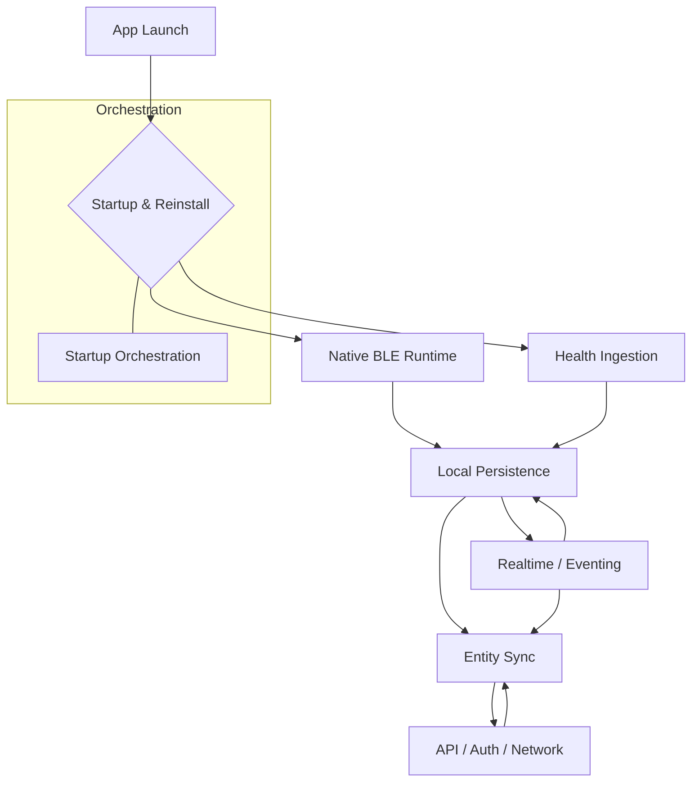

# Failure Modes

## Overview

This document serves as a reliability map for the app-side system, detailing its major failure domains and the architectural mechanisms designed to contain, prevent, detect, or tolerate them. It highlights intentional engineering choices made to ensure data integrity and user experience even under adverse mobile operating system constraints, unreliable networks, and complex data flows.

> **Scope:** This document focuses exclusively on client-side (iOS/Android) failure modes and containment mechanisms. It does not cover detailed backend failure analysis, exhaustive internal error codes, low-level third-party library internals, or historical bug-fix changelogs. Backend interactions are discussed as boundary conditions. It aligns with and cross-references: [architecture.md](architecture.md), [offline-sync.md](offline-sync.md), [health-ingestion.md](health-ingestion.md), [nativeBLE.md](nativeBLE.md), and [data-flow.md](data-flow.md).

---

## Reliability Model

The application's reliability model is built on an offline-first, local-first philosophy, where data integrity and graceful degradation are paramount. Failure handling is an integral part of the architecture, not an afterthought.

### Core Principles

- **Local-First / Offline-First:** Critical functionality remains available and data can be recorded even without network connectivity. Changes are queued and synced later.
- **Fail-Fast on Integrity:** Critical data integrity violations are detected early and, where configurable, lead to immediate termination or explicit error states to prevent silent corruption.
- **Retry and Degrade Gracefully:** Transient failures (network, rate limits) trigger exponential backoff and retries, while non-critical features may degrade gracefully.
- **Isolate Platform-Sensitive Native Work:** Complex, platform-specific interactions (BLE, HealthKit, OS lifecycle) are encapsulated in native modules with robust, self-healing logic.
- **Prevent Infinite Loops & Duplicate Processing:** Mechanisms exist to break out of stuck states (e.g., `FactoryResetGuard`), ensure idempotent operations (`payloadHash`), and handle duplicate events (`EventBuffer`).

### Four-Tiered Failure Handling

A key aspect of this system's reliability is its explicit distinction between how different types of failures are managed:

| Tier | Description | Example |
| :--- | :--- | :--- |
| **Prevented** | Architectural design actively makes certain failure modes impossible or highly improbable. | Reinstall loops bounded by `FactoryResetGuard`; cursor commits deferred until `IntegrityGate` passes. |
| **Detected** | Failures are explicitly identified and reported; the system may continue in a degraded state. | Orphaned foreign keys caught by `IntegrityGate`; invariant mismatches surfaced by catalog state checks. |
| **Tolerated** | The system continues to operate with reduced functionality while working towards recovery. | Offline mutations queued to `OutboxRepository`; sync cooldown/backoff; partial health backfill progress. |
| **Surfaced** | Failures are logged, exposed via status indicators, or made visible to the user for explicit retry/diagnosis. | Terminal auth failures triggering global logout; rate limiting messages in UI; network disconnection alerts. |

---

## Failure Domain Map

 

---

### 1. Startup, Reinstall, and Initialization Failures

This domain governs the application's first-run experience and resilience against problematic OS-level state. Failure handling here is strongly explicit in native iOS code.

> iOS Keychain state persists across app uninstalls, leading to stale authentication tokens and corrupted user data upon reinstall. Complex multi-phase startup (native, JS, DB) introduces hazards like UI freezes and race conditions.

**Failure Classes**

- Stale Keychain state after uninstall/reinstall
- Partial wipe failure during factory reset
- Infinite reset loops across launches for the same build
- Startup-order hazards (e.g., accessing DB before migrations)
- Startup service-init race conditions and UI-freeze prevention

**Containment**

- **Prevented:** `ReinstallDetector.swift` detects reinstall early. `FactoryResetGuard.swift` bounds reset attempts. `AppDelegate.mm` orchestrates atomic reset and partial failure recovery by re-seeding markers. `StartupOrchestrator` (`AppProvider.tsx`) phases initialization to prevent UI freezes and init races.
- **Detected:** `ReinstallDetector` and `FactoryResetModule.swift` log detection events and partial failures.
- **Tolerated:** Bounded retries for partial resets allow for self-healing across launches.
- **Surfaced:** A "Critical Application Error" screen in `AppProvider.tsx` offers "Retry Init" or "Factory Reset" options.

> **Residual Risk:** Android equivalents for native reinstall/reset logic are not explicitly evidenced in the current codebase.

*Related: [architecture.md](architecture.md), [nativeBLE.md](nativeBLE.md)*

---

### 2. Native BLE Runtime Failures

The mobile OS environment presents unique challenges for stable Bluetooth Low Energy communication. This domain is critical for device connectivity and data streaming.

> iOS/Android aggressively manage background processes and Bluetooth resources. Bonding/pairing can be fragile, and the native-JS bridge introduces latency and synchronization issues.

**Failure Classes**

- iOS process death / restoration-sensitive startup timing (`willRestoreState` missed)
- Connection drops and reconnect behavior (transient RF interference, device out of range)
- Bonding/key mismatch or "ghost bond" class failures (`CBError.peerRemovedPairingInformation`, `CBError.encryptionTimedOut`)
- Device-initiated sleep (`MSG_SLEEP`) and dormant reconnection cases
- Native-JS event starvation or listener inactivity issues (`EventBuffer` overflow)
- BLE receive buffer overflow from corrupt/rapidly streaming data

**Containment**

- **Prevented:** `AppDeviceBLEInitializer.initializeBLECore()` for early `CBCentralManager` init. `AppDeviceBLECore.swift` `EC-SLEEP-BOND-FIX-001` prioritizes device sleep signal over false bonding errors. `AppDeviceBLEModule.swift` `EventBuffer` with `EC-BUFFER-OVERFLOW-001/002` for buffering and overflow notification. `PROTOCOL_ACK_TIMEOUT_MS` for protocol ACK timeouts.
- **Detected:** `AppDeviceBLECore.swift` comprehensive `ConnectionState` machine with explicit `DisconnectReason` classification and GATT pipeline faults `EC-FAULT-001`. `AppDeviceBLEModule.swift` buffer overflow events via `onBufferOverflow`. `BluetoothHandler.ts` `checkBondHealth()` proactively identifies "ghost bond" issues.
- **Tolerated:** `BluetoothHandler.ts` `attemptReconnectionWithBackoff()` with `autoConnect: true` for persistent OS-level reconnection and "dormant reconnection" mode. `AppDeviceBLENative.setDeviceSleepFlag()` for graceful disconnect handling.
- **Surfaced:** UI alerts `onBondingLost` for pairing issues, `onOperationRejected` for operation failures. `BluetoothContext.tsx` alerts for max reconnect attempts.

> **Residual Risk:** Detailed native Android BLE resilience implementation is less explicit in the provided codebase. Subtle OS-level power management can still affect long-term background BLE.

*Related: [nativeBLE.md](nativeBLE.md)*

---

### 3. Health Ingestion and Background Processing Failures

Health data ingestion involves native HealthKit APIs, local storage, and background processing. Reliability is paramount due to data sensitivity and volume.

> Mobile OS imposes strict background execution limits. HealthKit queries can time out or hang. Large datasets (100k+ samples for backfill) require efficient, crash-safe processing.

**Failure Classes**

- Observer registration misses (missed background deliveries)
- Query timeout / hung query containment (`QUERY_TIMEOUT_SECONDS`)
- Background execution budget exhaustion (iOS app termination)
- Partial ingestion due to errors
- Empty-window backfill stalls for sparse metrics
- Crash between sample write and cursor advancement (data skipping)
- Local DB lock contention during native ingestion (`SQLITE_BUSY`)
- Stale or duplicated reads if cursor movement is incorrect

**Containment**

- **Prevented:** `HealthKitObserver.shared.registerDefaultObservers()` for early registration in `AppDelegate`. `HealthIngestCore.swift` `coldResumeIndex` for fairness, `coldBackfillEndTs`/`coldPageFromTs` for crash-safe incremental progress. `HealthIngestSQLite.swift` `BEGIN IMMEDIATE` transactions with CAS for atomic updates via `atomicInsertAndUpdateCursor()`.
- **Detected:** `HealthIngestCore.swift` `QUERY_TIMEOUT_SECONDS` for HK queries with `AtomicBool` cancellation flags. `HealthIngestSQLite.swift` `verifySchema()` for DB integrity.
- **Tolerated:** `HealthIngestCore.swift` `partial: true` for budget exceeded/cancellation, `coldCursorsAdvanced` tracks progress with 0 samples. `NativeHealthIngestModule.swift` hard 15-second timeout for background `CHANGE` lane.
- **Surfaced:** `NativeHealthIngestModule.swift` emits `NativeHealthIngest_Error` events (`.queryTimeout`, `.sqliteWriteFailed`).

> **Residual Risk:** Android Health Connect integration is not explicitly detailed in the provided codebase. Scalability for extremely large backfills on resource-constrained devices remains an open concern.

*Related: [health-ingestion.md](health-ingestion.md)*

---

### 4. Local Persistence and Data Integrity Failures

As a local-first application, the integrity of the local SQLite database is foundational to correct behavior and user trust.

> The local SQLite DB is the UI's source of truth. Offline mutations, multi-threaded access, schema migrations, and syncing logic all introduce opportunities for data corruption and inconsistency.

**Failure Classes**

- SQLite lock/contention risk from concurrent access
- Corrupted or inconsistent local state from partial writes or crashes
- Failed local mutations (database write errors)
- Stale persisted cache not reflecting true local or server state
- Orphaned foreign keys (child references non-existent parent)
- Inconsistent aggregates/read models (e.g., dashboard data)
- Crash-safety around atomic write-plus-cursor advancement

**Containment**

- **Prevented:** `db/client.ts` (WAL mode, `FULLMUTEX`, `busy_timeout`). `OutboxRepository.ts` atomic enqueue. `HealthSampleRepository.ts` `atomicInsertAndUpdateCursorAtomic()` ensures atomic data write/cursor update. `IntegrityGate.ts` runs before cursor commits, preventing bad cursors.
- **Detected:** `IntegrityGate.ts` uses `RELATION_GRAPH` to find orphaned FKs with `IntegrityViolation` reporting. `CursorRepository.ts` enforces monotonic cursor advancement, throws `CursorBackwardError`. `HealthIngestSQLite.swift` `verifySchema()` for table integrity.
- **Tolerated:** `IntegrityGate` in non-fail-fast mode logs violations and allows sync to proceed.
- **Surfaced:** `IntegrityGate.ts` `IntegrityReport` provides detailed results. `AppProvider.tsx` displays errors if core database initialization fails.

> **Residual Risk:** Scalability of SQLite for very large datasets. Potential for non-FK data inconsistencies.

*Related: [offline-sync.md](offline-sync.md), [data-flow.md](data-flow.md)*

---

### 5. Entity Sync Failures

The synchronization layer bridges the local offline-first state and the remote backend. Its reliability is critical for data consistency and user trust.

> Sync is inherently distributed and asynchronous. Network latency, packet loss, server-side errors, and concurrent modifications create numerous opportunities for conflicts, data loss, or inconsistent states.

**Failure Classes**

- Offline transition during sync
- App crash during push/pull or local mutation
- Partial success / partial failure in batch responses
- Concurrent sync triggers ("sync storms")
- Cursor corruption or bad cursor advancement
- Conflict resolution mismatch
- Rate limiting and retry/backoff behavior
- Data corruption detection via `IntegrityGate`
- Hot-reload/multi-instance coordination hazards (`DataSyncService` singletons)

**Containment**

- **Prevented:** `DataSyncService` `sharedSyncInProgress` mutex, `debouncedSyncTrigger`, and per-source cooldowns. `PushEngineCore.computeDeterministicSyncOperationId()` SHA-256 for server-side idempotency. `OutboxRepository.dequeueDeduplicatedByEntity()` one representative command per entity. `IntegrityGate` runs before cursor commits.
- **Detected:** `DataSyncService` `handle429RateLimitError()` applies exponential backoff. `PushEngineCore.shouldSkipCommand()` detects unpushable commands. `PullEngine.ts` does not advance cursors for entities with failures. `CursorRepository.ts` throws `InvalidCursorError`/`CursorBackwardError`.
- **Tolerated:** `OutboxRepository` queues offline mutations with `markFailed`/`markDeadLetter`. `BackendAPIClient` robust retry with exponential backoff/jitter. `SyncLeaseManager` admission control for bulk operations.
- **Surfaced:** `DataSyncService.getSyncState()` provides UI status, pending counts, and errors. `BackendAPIClient` logs `DebugRequestMetadata`. `DataSyncService` emits `WEBSOCKET_RECONNECT_FAILED`/`SYNC_CONFLICT_DETECTED` events.

> **Residual Risk:** Highly complex semantic conflicts may still require manual intervention. Reliability depends on backend API's consistent implementation of idempotency and merge rules.

*Related: [offline-sync.md](offline-sync.md), [data-flow.md](data-flow.md)*

---

### 6. Realtime, Eventing, and Listener Lifecycle Failures

Real-time events provide immediate UI feedback, but their asynchronous nature and the React Native lifecycle introduce complexities that can lead to subtle bugs.

> React Native's Hot Reload can create duplicate listeners leading to sync storms or memory leaks. Asynchronous event processing can lead to race conditions with stale data, and external WebSocket connections are inherently fragile.

**Failure Classes**

- Duplicate listeners after Hot Reload / re-instantiation
- Stale event application order
- Event delivery while services are disposed or not yet ready
- WebSocket-triggered sync storms
- Coordinator disposal and cleanup hazards (memory leaks)

**Containment**

- **Prevented:** `WebSocketClient.ts` singleton with `removeAllListeners()` on disconnect and `setUserIdGetter()` for tenancy validation. `EventEmitter.ts` `suppress()`/`resume()` for event storm prevention. `DataSyncService.debouncedSyncTrigger` batches local change events.
- **Detected:** `WebSocketClient` logs invalid event structures and detects `Backend userId mismatch` forcing disconnect.
- **Tolerated:** `WebSocketClient` graceful degradation on connection issues. `EventEmitter` catches errors in individual listeners.
- **Surfaced:** `WebSocketClient` logs connection/reconnection events and emits local events for UI updates.

> **Residual Risk:** Subtle memory leaks could occur in complex React Native component lifecycles combined with external event systems. `socket.io-client` provides "at-most-once" delivery; critical consistency relies on the broader sync mechanisms.

*Related: [data-flow.md](data-flow.md)*

---

### 7. API, Auth, and External Boundary Failures

Interactions with the backend API introduce failure modes related to network reliability, authentication state, and server behavior.

> The mobile network environment is inherently unreliable. Authentication tokens expire, backend APIs can be rate-limited or return complex errors, and clock skew can invalidate timestamps.

**Failure Classes**

- Expired auth/session during sync (`401 Unauthorized`)
- Backend rate limiting (`429 Too Many Requests`)
- Transient network failures (connection drops, timeouts)
- Idempotency assumptions at the boundary (duplicate requests, side effects)
- Stale connectivity detection (`NetInfo` reporting false positive)
- Clock skew between client and server (invalid timestamps)

**Containment**

- **Prevented:** `BackendAPIClient.ensureTokensFresh()` for proactive JWT refresh. `BackendAPIClient.throttleRequest()` prevents API spam. `BackendAPIClient.isRetryableError()` distinguishes retryable errors. `BackendAPIClient` `X-Correlation-ID` for idempotency.
- **Detected:** `BackendAPIClient` `processError()` categorizes errors, `updateRateLimitStatus()` parses headers, `serverTimeOffset` detects clock skew. `AuthContext.tsx` `handleAuthTerminalFailure()` for `401`s.
- **Tolerated:** `BackendAPIClient` robust retry with exponential backoff/jitter. `DataSyncService` static exponential backoff for rate limits.
- **Surfaced:** `BackendAPIClient` logs detailed request/response metadata. `AuthContext.tsx` sets error state and redirects on auth failure.

> **Residual Risk:** Backend API consistency and reliability is a critical external dependency. Extreme mobile network flakiness can still hinder effective communication.

*Related: [architecture.md](architecture.md)*

---

### 8. Startup Orchestration and Service Lifecycle Failures

Application initialization and service management require careful sequencing to avoid deadlocks, crashes, and poor user experience.

> A complex mobile app needs to initialize many services. Misordered dependencies can cause crashes (e.g., DB access before migration). Heavy I/O work can block the UI thread. Hot Reload during development can create ghost instances and duplicate listeners.

**Failure Classes**

- Heavy initialization work blocking first paint
- Service ordering problems (dependency not ready)
- Background initialization racing user-visible flows
- Partial startup success (some services failed)
- Cleanup and disposal of long-lived services on unmount/Hot Reload (memory leaks)

**Containment**

- **Prevented:** `StartupOrchestrator` (`AppProvider.tsx`) with phased startup, explicit task dependencies, and background tasks running after first paint. `DataSyncService.configureStartupGate()` delays heavy init. Singletons prevent multiple instances.
- **Detected:** `MainThreadBlockMonitor` monitors UI thread responsiveness.
- **Tolerated:** `StartupOrchestrator`'s `canFail` option for background tasks allows graceful degradation.
- **Surfaced:** `AppProvider.tsx` displays "Critical Application Error" screen on essential startup failures. Logs emitted for background task warnings.

> **Residual Risk:** Complex interactions with third-party SDK initializations might cause unexpected delays. Subtle memory leaks on specific Hot Reload sequences.

*Related: [architecture.md](architecture.md)*

---

## Known Limits and Gaps

This section clarifies areas where the current implementation or documentation has acknowledged limitations.

- **Android-Native Failure Handling:** The current evidence is predominantly iOS-centric, especially for low-level BLE (`AppDeviceBLECore.swift`), HealthKit (`HealthIngestCore.swift`), and app lifecycle management. While cross-platform abstractions exist, detailed native Android failure containment strategies are less explicitly surfaced.

- **Backend Internals:** This document focuses on app-side resilience. Client components (`BackendAPIClient`, `DataSyncService`) make assumptions about backend behavior (`payloadHash` idempotency, `Retry-After` headers) documented as boundary conditions. A full backend failure analysis is a separate document.

- **Health Read-Model Maturity:** The core health ingestion pipeline (`HealthIngestCore`, `HealthIngestSQLite`) is robustly engineered. The downstream `HealthProjectionRefreshService` for computed projections is a newer feature. While designed for resilience, the long-term completeness of derived read models is still maturing.

- **UI-Layer Failures:** This document's scope is architectural resilience. It does not cover React rendering errors, component-level state inconsistencies, or UX degradation not directly tied to underlying system failures.

---

## Verification Surface

The reliability claims in this document are supported by testing across the following layers:

| Layer | Coverage |
| :--- | :--- |
| **Native iOS** | Unit and integration tests for `ReinstallDetector`, `FactoryResetGuard`, `KeychainWipeModule`, `HealthIngestCore`, and `AppDeviceBLECore` verify core native logic and OS interactions. |
| **BLE Integration** | End-to-end tests covering connection, reconnection, data transfer, and error handling through the native-JS bridge. |
| **Health Ingestion** | Tests for `HealthIngestSQLite`, `HealthSampleRepository`, and `HealthDeletionQueueRepository` verify atomicity, cursor integrity, and crash recovery. |
| **Offline Sync** | Comprehensive tests for `OutboxRepository`, `CursorRepository`, `IdMapRepository`, `TombstoneRepository`, and sync handlers verify transactional behavior, idempotency, FK resolution, and conflict resolution. |
| **Startup** | Tests for `StartupOrchestrator` verify correct service initialization order and error handling during startup phases. |

---

## Related Documents

| Document | Focus Area |
| :--- | :--- |
| [**architecture.md**](architecture.md) | Layered system model, service boundaries, data ownership, and lifecycle orchestration |
| [**offline-sync.md**](offline-sync.md) | Transactional outbox, cursor-based pull, conflict resolution, and integrity validation |
| [**health-ingestion.md**](health-ingestion.md) | Native iOS ingestion lanes, atomic persistence, upload path, and projection refresh |
| [**nativeBLE.md**](nativeBLE.md) | CoreBluetooth runtime, state restoration, bridge design, and protocol boundaries |
| [**data-flow.md**](data-flow.md) | End-to-end data movement across layers, pipelines, and external boundaries |
| `decisions/` | Architectural Decision Records |
