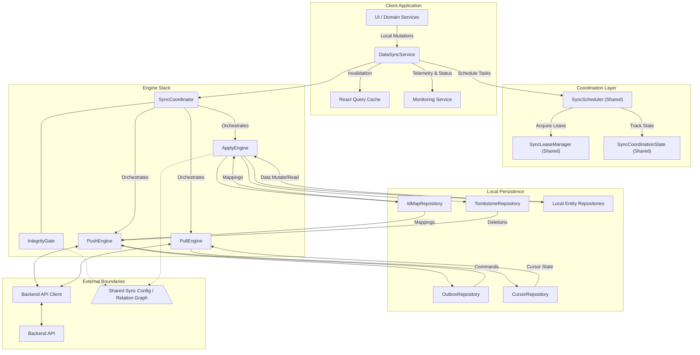
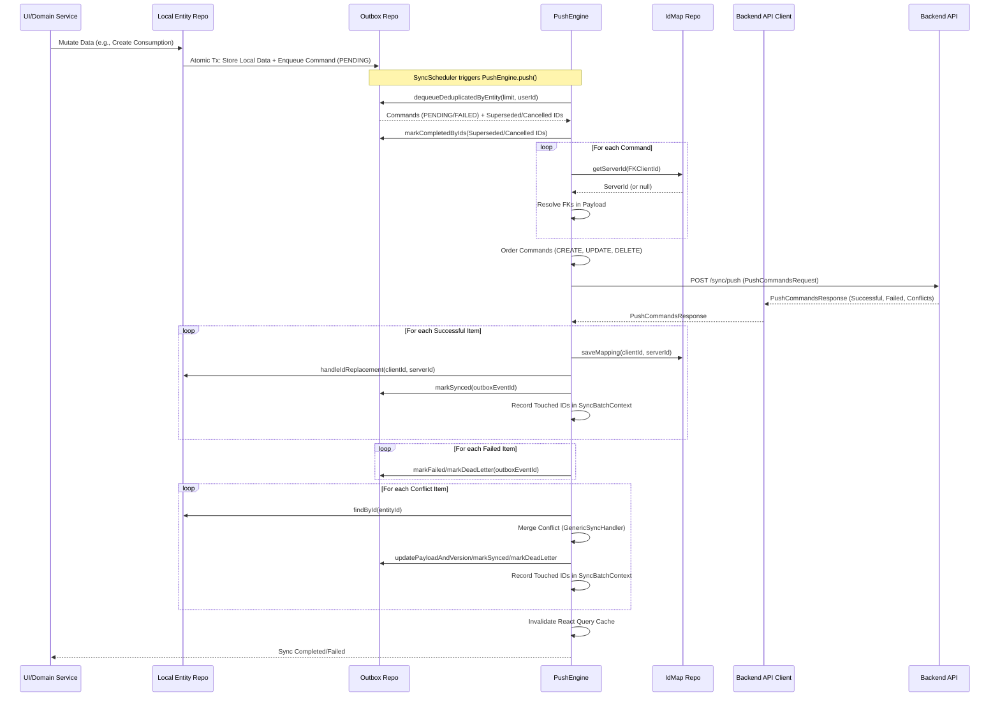
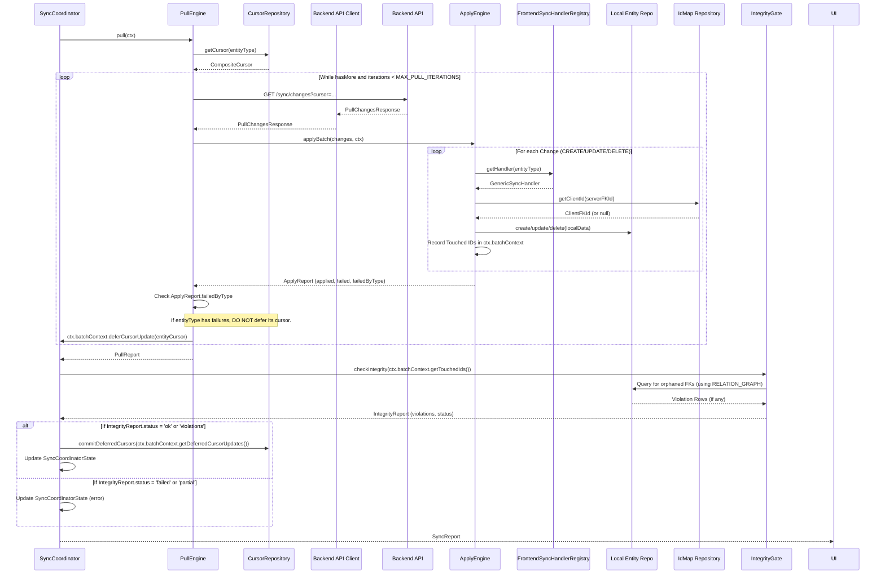
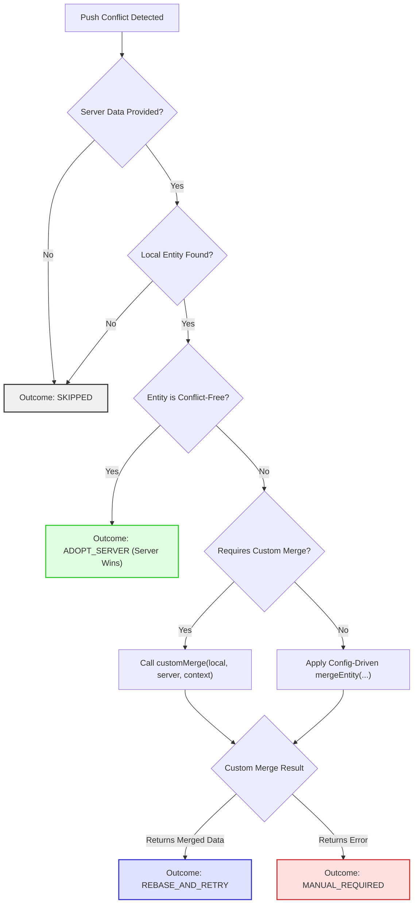

# Offline Entity Sync

## Overview

The app-side entity synchronization system is a foundational component of the local-first architecture. It enables users to interact with their data instantly, even offline, with changes durably stored in SQLite. This document explains how local mutations are propagated to the backend, how server changes are applied, how data consistency is maintained through conflict resolution, and how relational integrity is validated after sync operations. It is designed as a first-class platform concern, showcasing a sophisticated, robust, and observable synchronization architecture.

> **Scope:** This document focuses on app-side **entity synchronization** (consumptions, sessions, products, journals, devices) between local SQLite and the backend API. It does not cover health data synchronization (`HealthSyncService`, see [health-ingestion.md](health-ingestion.md)), backend sync internals, or UI/presentation logic. For broader context, see [architecture.md](architecture.md) and [data-flow.md](data-flow.md). Failure scenarios are elaborated in [failure-modes.md](failure-modes.md).

---

## Design Goals

*   **Instant Local Responsiveness** — UI updates immediately from local SQLite, providing an uninterrupted user experience.
*   **Durable Local Mutations** — All offline changes are durably stored in a transactional outbox, protected against app crashes and network outages.
*   **Eventual Consistency** — Local data reliably converges with the server's authoritative state over time.
*   **Deterministic Conflict Handling** — Divergent changes are reconciled predictably through a configurable, entity-specific merge strategy.
*   **Forward-Only Sync Progress** — Cursors advance monotonically, ensuring no data is accidentally re-processed or skipped.
*   **Post-Sync Relational Integrity** — Local foreign key relationships are validated after server changes are applied, preventing data corruption.
*   **Bounded Retries & Recoverability** — Sync operations are resilient to transient failures with exponential backoff and explicit recovery mechanisms.

---

## Sync Architecture at a Glance

The synchronization architecture follows a layered, composable design, orchestrated by the `DataSyncService` facade:

*   **UI/Domain Services** — The application's frontend and business logic, initiating local data mutations.
*   **`DataSyncService`** — The primary facade, orchestrating sync and invalidating the `React Query Cache`.
*   **Coordination Layer** — Shared components (`SyncScheduler`, `SyncLeaseManager`, `SyncCoordinationState`) managing tasks, resource access, and global sync state across multiple potential instances.
*   **Engine Stack** — The core logic units: `SyncCoordinator` orchestrates `PushEngine`, `PullEngine`, and `ApplyEngine`.
*   **Local Persistence** — Dedicated SQLite repositories (`OutboxRepository`, `CursorRepository`, `IdMapRepository`, `TombstoneRepository`, `Local Entity Repositories`) for offline data storage and sync metadata.
*   **External Boundaries** — Interaction with the `Backend API` via the `Backend API Client`, guided by `Shared Sync Config / Relation Graph`, and validated by `IntegrityGate`.

<div align="center">
  
</div>

<br>

<details>
<summary><strong>Detailed Component Interaction (Mermaid)</strong></summary>
<br>



</details>

---

## Core Building Blocks

The sync subsystem is built upon a set of well-defined components, each with a clear responsibility.

### Offline Repositories (`code-snippets/repositories/offline/`)

These repositories (`code-snippets/repositories/offline/index.ts`) manage the local SQLite database for transactional outbox patterns, cursor-based synchronization, and deletion tracking.

*   **`OutboxRepository`** — Manages the `outbox_events` table. This is the queue for all local mutations (CREATE, UPDATE, DELETE). It handles in-memory deduplication of commands for the same entity and manages retry states. Outbox event IDs are UUIDs.
*   **`CursorRepository`** — Manages the `cursor_state` table. It tracks the last successfully processed record for each `EntityType` using a `lastCreatedAt` timestamp and `lastId` UUID. Crucial for incremental pull operations and enforcing monotonic cursor advancement.
*   **`IdMapRepository`** — Manages the `id_map` (or `sync_metadata`) table. Stores the essential mapping between client-generated UUIDs (`clientId`) and server-assigned UUIDs (`serverId`), vital for resolving foreign keys and managing ID replacements.
*   **`TombstoneRepository`** — Manages the `tombstones` table. Records soft-deleted entities that need to be propagated as `DELETE` operations to the backend, ensuring eventual consistency for removals.

### Service Facade (`DataSyncService`)

Located at `code-snippets/services/sync/DataSyncService.ts`, this class is the primary entry point for the sync subsystem. It orchestrates the high-level sync flow, manages global sync state, integrates with `AuthTokens` (via `BackendAPIClient`) and `DeviceIdManager`, and delegates the core sync logic to the `SyncCoordinator` engine stack. It also includes robust mechanisms for handling network connectivity, app lifecycle changes, and triggering syncs based on local data mutations.

### Coordination & Resource Management

*   **`SyncScheduler`** (`code-snippets/services/sync/SyncScheduler.ts`) — A shared, global scheduler that prioritizes and queues various sync-related tasks (`data_sync`, `health_ingest`, `catalog_sync`). It manages concurrency limits for resources like network and SQLite access, integrating with `CooperativeYieldController` for main thread responsiveness.
*   **`SyncLeaseManager`** (`code-snippets/services/sync/SyncLeaseManager.ts`) — Responsible for acquiring and managing `SyncLease`s from the backend (`/sync/lease` endpoint). Leases provide admission control for bulk operations (e.g., large catalog syncs, health data uploads), preventing server overload and ensuring fair resource usage.

### Engine Stack (`code-snippets/services/sync/engines/`)

The core sync logic is implemented as a composable engine stack (`code-snippets/services/sync/engines/index.ts`), orchestrated by the `SyncCoordinator`. This architecture (defined in `code-snippets/services/sync/engines/compositionRoot.ts`) promotes modularity and testability.

*   **`SyncCoordinator`** (`code-snippets/services/sync/engines/SyncCoordinator.ts`) — The main orchestrator of the entire sync lifecycle. Acquires global locks, initializes the `SyncBatchContext`, sequentially executes the `PushEngine`, `PullEngine`, and `IntegrityGate` phases, and commits deferred cursors upon successful completion.
*   **`PushEngine`** (`code-snippets/services/sync/engines/PushEngine.ts`) — Responsible for the push phase. Dequeues local changes from `OutboxRepository` and `TombstoneRepository`, resolves foreign keys, orders commands, constructs `PushCommandsRequest` payloads, sends them to the backend API, and processes the `PushCommandsResponse`.
*   **`PullEngine`** (`code-snippets/services/sync/engines/PullEngine.ts`) — Manages the pull phase. Builds a `CompositeCursor` from individual entity cursors, fetches changes from the backend's `/sync/changes` endpoint, and delegates the application of these changes to the `ApplyEngine`.
*   **`ApplyEngine`** (`code-snippets/services/sync/engines/ApplyEngine.ts`) — Executes the apply phase. Receives `PullChangeItem`s (CREATE, UPDATE, DELETE) and applies them to the local SQLite database. Leverages `FrontendSyncHandlerRegistry` for entity-specific logic or falls back to generic SQL builders.

### Handler / Config Layer

*   **`FrontendSyncHandlerRegistry`** (`code-snippets/services/sync/handlers/FrontendSyncHandlerRegistry.ts`) — A central registry that maps each `EntityType` to its corresponding `FrontendSyncEntityHandler` implementation, enabling the engine stack to dynamically select the correct handler for each entity.
*   **`GenericSyncHandler`** (`code-snippets/services/sync/handlers/GenericSyncHandler.ts`) — A highly configurable handler implementing the `FrontendSyncEntityHandler` interface. Uses shared conflict configurations (`conflict-configs.ts`) and pure custom merge functions (from `code-snippets/services/sync/utils/custom-merges/`) to manage local entity persistence, conflict resolution, and ID replacement cascades (`CascadeExecutor`). Used for most entity types, with specific merge logic delegated to pure functions.
*   **Shared Sync Config / Relation Graph** — Canonical definitions (`packages/shared/src/sync-config/`) specifying entity relationships (`RELATION_GRAPH.ts`), conflict resolution policies (`ENTITY_CONFLICT_CONFIG.ts`), and cursor semantics (`cursor.ts`). These shared contracts ensure consistent behavior across frontend and backend.

---

## Sync Metadata Model

The sync subsystem relies on dedicated local metadata tables in SQLite (`code-snippets/db/schema.ts`) to manage its state and guarantee correctness. This metadata is distinct from the primary domain data.

| Metadata Artifact | Purpose | Key Fields | Updated By | Consumed By | Failure Role |
| :--- | :--- | :--- | :--- | :--- | :--- |
| **Outbox Events** | Queue local mutations for push to backend | `id` (UUID), `aggregateId`, `payload`, `status` | UI/Domain Services (atomic tx) | PushEngine | Retry / Dead Letter |
| **Cursor State** | Track progress for incremental pull | `entityType`, `lastCreatedAt`, `lastId` | PullEngine (deferred commit) | PullEngine, Backend API (`/sync/changes`) | Monotonicity Failure |
| **ID Map** | Map `clientId` to `serverId` for FK resolution | `clientId`, `serverId` | PushEngine | PushEngine (FK resolution), ApplyEngine | FK Resolution Error |
| **Tombstones** | Queue soft-deleted entities for `DELETE` propagation | `entityId`, `deletedAt`, `syncStatus` | Local Repositories (soft-delete) | PushEngine | Deletion Confirmation |
| **`SyncBatchContext`** | In-memory, per-sync-run context for integrity checking | `batchId`, `touchedSourceIds`, `deferredCursors` | Push/Pull/Apply Engines | SyncCoordinator, IntegrityGate | Scoping / Coordination |

---

## Push Path: Local Mutation to Backend Submission

The push path guarantees that local mutations made while offline or online are durably committed locally and eventually synchronized to the backend.

1.  **Local Mutation & Outbox Enqueue** — When a user creates, updates, or deletes an entity, the UI/domain service calls the local entity repository. This operation is performed **atomically within a single SQLite transaction** that both updates the local domain table *and* enqueues a corresponding command (CREATE, UPDATE, or DELETE) into the `OutboxRepository` (`code-snippets/repositories/offline/OutboxRepository.ts`). This ensures that a local change is never committed without a corresponding outbox entry.

2.  **Command Dequeue & Deduplication** — The `PushEngine` (`code-snippets/services/sync/engines/PushEngine.ts`) periodically (or on demand) dequeues a batch of actionable commands from the `OutboxRepository`. This includes commands with a `PENDING` status (new mutations) and retryable `FAILED` commands (previous transient failures). The dequeue process performs in-memory deduplication:
    *   Multiple `UPDATE`s for the same entity are resolved to the latest version.
    *   A `CREATE` followed by a `DELETE` for an entity not yet synced is cancelled (net no-op).

    > **Critical:** Superseded or cancelled commands are immediately marked `COMPLETED` in the `OutboxRepository` to prevent infinite loops and stale replays.

3.  **FK Resolution & Command Ordering:**
    *   **Foreign Key Resolution** — `PushEngine`'s `resolveForeignKeys` function (which leverages pure `PushEngineCore` functions and `IdMapRepository`) resolves client-generated UUIDs within command payloads (e.g., `consumption.productId`) to server-assigned UUIDs. If an FK cannot be resolved (e.g., the target entity is also client-generated and not yet synced), it may be nullified (if optional) or kept (if mandatory, leading to backend rejection).
    *   **Dependency-Based Ordering** — Commands are sorted to respect foreign key dependencies: `CREATE` operations are prioritized over `UPDATE`s and `DELETE`s. Within `CREATE`s, parent entities (e.g., `products`, `devices`) are ordered before their children (e.g., `consumptions`, `sessions`) using the `ENTITY_SYNC_ORDER` from `@shared/contracts`. This prevents FK constraint violations at the backend.

4.  **Push Request Construction** — `PushEngine` constructs a `PushCommandsRequest` payload. This includes the `deviceId` (from `DeviceIdManager`) and a *deterministic `syncOperationId`* (a SHA-256 hash of the outbox event IDs in the batch) for backend idempotency.

5.  **Backend Submission** — The `BackendAPIClient` sends the `PushCommandsRequest` payload to the backend's `/sync/push` endpoint.

6.  **Response Processing & Local Updates** — Upon receiving the `PushCommandsResponse` from the backend, `PushEngine` processes the results:
    *   **Successful Items** — For each successfully pushed item, `IdMapRepository` stores the `clientId` -> `serverId` mapping. `GenericSyncHandler.handleIdReplacement` (for Model A entities) performs transactional FK cascades in the local SQLite database, replacing the client-generated primary ID with the new `serverId` and updating all references. The original outbox command is then marked `COMPLETED`.
    *   **Failed Items** — Commands that failed at the backend are marked `FAILED` (if retryable) or `DEAD_LETTER` (if non-retryable) in the `OutboxRepository`, entering their respective retry/quarantine lifecycles.
    *   **Conflicts** — Handled by `GenericSyncHandler.handleConflictV2`, which returns an explicit `ConflictResolutionOutcome` (e.g., `ADOPT_SERVER`, `REBASE_AND_RETRY`, `SKIPPED`, `MANUAL_REQUIRED`) that dictates subsequent outbox actions.

7.  **Tombstone Propagation** — In parallel or as a subsequent step, `PushEngine` also pushes soft-deleted entities tracked in `TombstoneRepository` to the backend as `DELETE` commands, marking them `SYNCED` or `FAILED` based on the response.

8.  **Cache Invalidation** — After successful pushes, `DataSyncService` triggers `react-query` cache invalidation for relevant entity types, ensuring the UI reflects the latest state.

> **Guarantee:** A local change is never committed without a corresponding outbox entry. No mutation is silently lost.

<div align="center">
  
</div>

<br>

<details>
<summary><strong>Detailed Push Sequence (Mermaid)</strong></summary>
<br>



</details>

---

## Pull and Apply Path: Server Delta to Local State

The pull and apply path ensures that backend-originated changes are safely incorporated into the local database, maintaining consistency and enabling eventual convergence.

1.  **Cursor-Based Delta Fetch** — `PullEngine` initiates the process by retrieving the latest `CompositeCursor` from `CursorRepository`. This composite cursor encapsulates the individual `EntityCursor`s for each `EntityType`, representing the earliest sync position across all entities. `PullEngine` then sends a GET request to the backend's `/sync/changes` endpoint, including this composite cursor and the `deviceId`.

2.  **Pull Response Structure** — The backend responds with a `PullChangesResponse` containing `PullChangeItem`s (CREATE, UPDATE, DELETE) representing changes since the provided cursor, a new `CompositeCursor` for the next page (or `null` if no more changes), and per-entity `EntityCursor`s (`entityCursors`).

3.  **Per-Entity Application** — `PullEngine` iteratively processes the `PullChangeItem`s, delegating each to the `ApplyEngine`.
    *   `ApplyEngine` dispatches the change to the `FrontendSyncHandler` registered for that `EntityType` (typically `GenericSyncHandler`).
    *   Handlers `create`, `update`, or `delete` the corresponding local SQLite record. For `CREATE`/`UPDATE` operations, the `ForeignKeyResolver` maps any server-provided FK UUIDs to local client UUIDs before the data is persisted, preserving local referential integrity.
    *   **Public Catalog Skip** — `ApplyEngine` contains logic to skip `CREATE`/`UPDATE` operations for public catalog `products` (`isPublic = true`), as these are managed exclusively by a local bundled snapshot and should not be overwritten by sync.

4.  **ID Replacement & Touched-ID Tracking** — As changes are applied, `ApplyEngine` (via the handlers) meticulously tracks which local entity IDs were modified (`touchedSourceIds`) and which parent entity IDs were referenced or affected (`touchedTargetIds`) by these changes. This information is stored in the `SyncBatchContext` and is crucial for the post-sync `IntegrityGate` checks.

5.  **Deferred Cursor Advancement** — `PullEngine` does *not* immediately commit the new cursors received from the backend. Instead, it defers them to `SyncBatchContext`. A critical invariant is enforced: cursors for any `EntityType` that encountered `Apply` failures in the current batch are *not* deferred, guaranteeing that affected changes are re-fetched in the next sync cycle.

6.  **Pagination** — If the backend response indicates `hasMore`, `PullEngine` fetches subsequent pages using the `nextCursor` until all changes are retrieved or a maximum number of pull iterations (`MAX_PULL_ITERATIONS`) is reached, preventing unbounded loops.

7.  **Sync Report Aggregation** — Results from all pull iterations and apply operations are aggregated into a `PullReport`, providing a comprehensive summary of the pull phase's outcome.

> **Guarantee:** Cursors never advance past corrupted state. Data integrity is enforced structurally, not by convention.

<div align="center">
  
</div>

<br>

<details>
<summary><strong>Detailed Pull / Apply / Integrity Sequence (Mermaid)</strong></summary>
<br>



</details>

---

## Conflict Resolution

The app's conflict resolution model leverages a config-driven approach for deterministic and consistent merging of divergent local and server changes.

*   **Generic Handler Model** — The `GenericSyncHandler` (`code-snippets/services/sync/handlers/GenericSyncHandler.ts`) acts as the unified conflict resolution engine for most entity types. This replaces a proliferation of entity-specific merge logic with a single, highly configurable implementation.

*   **Shared Conflict Configuration** — The core merge logic is driven by `ENTITY_CONFLICT_CONFIG` (from `@shared/contracts/sync-config/conflict-configs.ts`). This immutable configuration defines `fieldPolicies` for each entity (e.g., `LOCAL_WINS`, `SERVER_WINS`, `MERGE_ARRAYS`, `MONOTONIC`) and `serverDerivedFields` that are always authoritative. This shared contract ensures consistent merge behavior across frontend and backend.

*   **Deterministic Merge Behavior** — The pure `mergeEntity()` function (from `@shared/contracts/sync-config/entity-merger.ts`), or specific `customMerge` functions, are used for conflict resolution. These functions are stateless, side-effect-free, and leverage a `MergeContext` (which includes a deterministic timestamp `now`) to ensure that the same inputs always produce identical merged outputs.

*   **Custom Merge Escape Hatches** — For entities with particularly complex merge logic that cannot be expressed purely through field policies (e.g., `sessions` with server-derived aggregates, `consumptions` with idempotency keys, `products` with public/private splits, `devices` with ephemeral data handling, `journal_entries` with array unions and deep object merges), `GenericSyncHandler` delegates to specific pure `customMerge` functions (defined in `code-snippets/services/sync/utils/custom-merges/`). This provides flexibility without sacrificing the generic handler model.

*   **Conflict Outcomes** — Resolution during the push phase yields an explicit `ConflictResolutionOutcome` (`ADOPT_SERVER`, `REBASE_AND_RETRY`, `MANUAL_REQUIRED`, `SKIPPED`), dictating precise actions on the outbox command (e.g., mark `COMPLETED`, update payload for retry, move to `DEAD_LETTER`).

*   **Conflict-Free Entities** — Certain entities (e.g., `ai_usage_records`) are designated `conflictFree` in `ENTITY_CONFLICT_CONFIG`. These are typically append-only logs where each record is unique, structurally preventing conflicts. They bypass complex merge logic.

> **Guarantee:** Every conflict outcome is reproducible, auditable, and testable in isolation. No ad-hoc merge logic exists outside the shared configuration.

<div align="center">
  
</div>

<br>

<details>
<summary><strong>Detailed Conflict Resolution Flow (Mermaid)</strong></summary>
<br>



</details>

---

## Cursor Semantics and Progress Guarantees

Cursors are fundamental to the incremental synchronization model, providing strict guarantees about data processing and progress.

*   **What Cursors Are** — Lightweight, opaque markers (`lastCreatedAt` timestamp, `lastId` UUID) that represent the last successfully processed record for a given `EntityType`, stored in `CursorRepository`.

*   **Per-Entity Progress** — The system tracks an independent `EntityCursor` for each `EntityType`. This allows different entities to synchronize at their own pace, crucial for large datasets where not all data types change simultaneously.

*   **Composite Cursor** — For API communication, `EntityCursor`s are combined into a `CompositeCursor`. This composite cursor is typically set to the *earliest* position across all entities (`MIN` strategy) to ensure no changes are missed for any entity type.

*   **Forward-Only / Monotonic Advancement** — Cursors *must* always advance monotonically (forward in time/ID). Any attempt to move a cursor backward (`CursorBackwardError`) is treated as a critical error, signaling data corruption or a sync logic bug. This invariant prevents re-processing already-synced data or skipping future data.

*   **Failure Deferral** — Cursors are **only committed to storage** after the `Apply` phase has successfully processed all changes for that entity type and the `IntegrityGate` has passed. If `Apply` fails for an entity, its cursor is *not* advanced, guaranteeing that affected changes are re-fetched in the next sync cycle.

*   **Idempotency** — Cursors integrate with idempotent backend API endpoints. Replaying a sync request with the same cursor multiple times will not lead to duplicate data or incorrect state changes.

> **Guarantee:** Cursors advance monotonically and are never committed past corrupted state. At-least-once delivery of server changes is structurally enforced.

---

## Integrity Gate and Relational Correctness

The `IntegrityGate` (`code-snippets/services/sync/IntegrityGate.ts`) is a post-sync validation step designed to detect and prevent data corruption in the local SQLite database.

*   **Why it Runs After Sync** — The `IntegrityGate` operates *after* the `Pull` phase has applied all server changes (and potentially after `Push` has completed its ID replacements and cascades), but *before* cursors are committed. Any referential integrity violations caused by the sync operation are caught before the sync is declared successful and cursors are advanced.

*   **`RELATION_GRAPH` as Source of Truth** — `IntegrityGate` leverages the canonical `RELATION_GRAPH` (`@shared/contracts/sync-config/relation-graph.ts`) as its authoritative model for all foreign key relationships between entities.

*   **Targeted Orphan Detection** — To optimize performance, the `IntegrityGate` performs *scoped* checks using `touchedIds` (IDs of local source rows modified in the current sync batch) and `touchedTargetIds` (IDs of parent rows that were replaced or deleted) from `SyncBatchContext`. This focuses queries on potentially affected relationships.

*   **SQL Query Building** — Pure functions like `buildOrphanDetectionQuery()` and `buildTargetSideOrphanQuery()` (`code-snippets/services/sync/IntegrityGate.ts`) generate parameterized SQL queries to efficiently find `IntegrityViolation`s (orphaned FK references).

*   **Operational Meaning of Failures:**
    *   **`IntegrityViolationError`** — Thrown in `failFastMode` when orphaned FK references are detected for *required* FKs. Indicates actual data corruption that must be addressed immediately.
    *   **`IntegrityCheckExecutionError`** — Thrown if the integrity check itself cannot complete (e.g., a database query fails). Local integrity is `UNKNOWN` and the sync is aborted.
    *   **Optional FK Violations** — For nullable FKs, violations are logged as warnings but do not trigger `failFastMode`, allowing the sync to complete (degraded but functional).

*   **Fail-Fast Policy** — The `IntegrityGate` defaults to `failFastMode = true`, meaning it throws `IntegrityViolationError` on *required* FK violations. This prevents corrupted data from being silently committed and ensures data integrity is upheld as a critical system invariant.

> **Guarantee:** No corrupted relational state is silently committed. Required FK violations abort the sync; cursors do not advance past integrity failures.

<details>
<summary><strong>Detailed Integrity Gate Flow (Mermaid)</strong></summary>
<br>

```mermaid
graph TD
    A[SyncCoordinator Triggers IntegrityGate] --> B[Get Touched IDs from SyncBatchContext]
    B --> C{"Determine Relations to Check<br/>(from RELATION_GRAPH)"}
    C --> D[Initialize IntegrityReport]

    loop For each Relation
        D --> E{"Determine Scoping<br/>(touchedSourceIds, etc)"}
        E --> F{"Execute Orphan Detection Query"}
        F -->|Query SQL| DB[(Local SQLite DB)]
        DB -->|Orphan Rows| F
        F --> G[Collect Violations in IntegrityReport]

        G --> H{"Query Failed?"}
        H -->|Yes| I["Mark Relation Status: FAILED"]
        H -->|No| J{"Violations Found?"}
        J -->|Yes| K["Mark Relation Status: SUCCESS + VIOLATIONS"]
        J -->|No| L["Mark Relation Status: SUCCESS"]
    end

    H -.-> M
    K -.-> M
    L -.-> M[Finalize IntegrityReport]
    M --> N{"failFastMode = true<br/>AND Required FK Violations?"}
    N -->|Yes| O[Throw IntegrityViolationError]
    N -->|No| P[Return IntegrityReport]

    style DB fill:#e0e0ff,stroke:#33c,stroke-width:2px
    style O fill:#ffe0e0,stroke:#c33,stroke-width:2px
```

</details>

---

## Coordination and Runtime Behavior

The sync subsystem incorporates sophisticated coordination mechanisms to ensure stability, efficiency, and correct behavior under various runtime conditions.

*   **Shared Scheduler (`SyncScheduler`)** — `DataSyncService` integrates with a global `SyncScheduler` to prioritize and queue sync tasks (`data_sync`, `health_ingest`, `catalog_sync`). This prevents resource contention and ensures high-priority tasks (e.g., user-initiated sync) are executed before low-priority background tasks. It also uses `CooperativeYieldController` for time-budgeted work, preventing UI freezes on the main thread during heavy sync operations.

*   **Shared Lease Management (`SyncLeaseManager`)** — `SyncLeaseManager` acquires `SyncLease`s from the backend for bulk operations. This acts as an admission control mechanism, preventing multiple clients from simultaneously overloading the backend and ensuring fair resource allocation.

*   **Debounced Local-Change Sync** — `DataSyncService.setupEventListeners` uses `lodash.debounce` to batch multiple rapid local mutations (`dbEvents.DATA_CHANGED` from `FrontendConsumptionService`) into a single `performFullSync` call, preventing sync storms from frequent user interactions.

*   **Startup Gating** — `DataSyncService.configureStartupGate` allows delaying heavy sync initialization tasks until after the application's first paint, ensuring the UI becomes interactive quickly without being blocked by background sync setup.

*   **Duplicate-Instance / Hot-Reload Protections** — The `SyncCoordinationState` (a static singleton) is a critical component for handling React Native's Hot Reload/Fast Refresh challenges. It manages mutexes and shared timing state (`_lastSyncSourceTime`, `_backoffMs`) to prevent:
    *   Race conditions where multiple `DataSyncService` instances (created during Hot Reload) try to initialize or run sync simultaneously.
    *   State loss or corruption due to `static` variables being reset on module reload.

*   **Network & AppState Awareness** — `DataSyncService` uses `NetInfo` to monitor network connectivity, triggering syncs automatically upon reconnection. An `AppState` listener adjusts the periodic sync interval (faster in foreground, slower in background for battery saving) and triggers syncs when the app returns to the foreground.

---

## Failure Handling and Recovery

The sync subsystem is designed for resilience, with explicit failure handling and recovery mechanisms at multiple layers.

*   **Typed Errors** — `SyncEngineError` (from `code-snippets/services/sync/engines/types.ts`) provides structured, machine-readable error codes (`NETWORK_ERROR`, `RATE_LIMITED`, `FK_RESOLUTION_FAILED`, `INTEGRITY_VIOLATION`, etc.) and a `retryable` flag, enabling programmatic error handling and targeted retry strategies.

*   **Retryable vs. Non-Retryable Failures:**
    *   **Retryable** — Transient errors (network outages, temporary server errors, rate limits) are retried with exponential backoff and jitter (`BackendAPIClient`).
    *   **Non-Retryable** — Terminal errors (schema validation failures, authentication errors, non-retryable backend rejections) cause the affected commands to be moved to the `DEAD_LETTER` queue, preventing infinite retry loops.

*   **Partial Push / Partial Pull Behavior:**
    *   **Push** — If some commands in a push batch fail, only those failing commands are marked `FAILED` (or `DEAD_LETTER`). Successfully pushed commands are processed normally.
    *   **Pull** — If `ApplyEngine` fails to apply a `PullChangeItem`, the `PullEngine` does *not* advance the cursor for that entity type. This ensures the failed change is re-fetched in the next sync cycle.

*   **Rate Limiting & Backoff** — `BackendAPIClient` and `SyncCoordinationState` implement exponential backoff on 429 (`RATE_LIMITED`) errors, with server-provided `Retry-After` headers taking precedence. This prevents overwhelming the backend during high-traffic periods.

*   **Corrupted Payload / Dead-Letter / Quarantine** — `OutboxRepository` strictly validates command payloads. Corrupted commands are moved to the `DEAD_LETTER` queue (`OutboxRepository.markDeadLetter`) rather than silently causing `Apply` failures. Commands exhausting their retry attempts (`PushEngine.markRetryExhaustedAsDeadLetter`) are also moved to `DEAD_LETTER`, making terminal failures explicit for monitoring and manual intervention.

*   **Data Integrity Failure Handling** — `IntegrityGate` errors (violations or execution failures) are handled based on the configured `failFastMode`. In production, required FK violations cause `IntegrityViolationError` to be thrown, ensuring sync is aborted until integrity is restored.

*   **Crash-Safety** — The sync metadata model is designed for crash recovery. Mechanisms like lease-based expiry (`stateUpdatedAtMs`) for staged items ensure that commands or samples stuck mid-process due to app crashes are reset to a `PENDING` state for retry.

---

## Boundaries and Neighboring Subsystems

Entity synchronization interacts with, but maintains clear boundaries from, other critical app subsystems.

*   **Backend API Boundary** — Interaction is strictly via the `BackendAPIClient` using defined API contracts (e.g., `PushCommandsRequest`, `PullChangesResponse` from `health.contract.ts`, `sync.schemas.ts`). This ensures loose coupling and allows independent evolution of client and server.

*   **Realtime Notification Boundary (`WebSocketClient`)** — Provides immediate event notifications (e.g., `consumption.created`). These act as freshness hints or triggers for `DataSyncService` to run an expedited sync, enhancing UI reactivity. WebSockets do not replace the transactional guarantees of the HTTP-based push/pull sync.

*   **Health Sync Boundary (`HealthSyncService`)** — The `HealthSyncService` handles synchronization of health data (from HealthKit/Health Connect to the backend). It is a parallel subsystem that shares the `SyncScheduler` and `SyncLeaseManager` for coordination but manages its own repositories (`HealthSampleRepository`), ingestion logic (`HealthIngestCore`), and payload formats (`BatchUpsertSamplesRequest`).

*   **Query Cache / UI Invalidation Boundary (`QueryClient`)** — `DataSyncService` integrates with `react-query` by invalidating caches (`queryClient.invalidateQueries`) after successful `Push` and `Apply` phases. This triggers UI components (via hooks) to refetch fresh data, maintaining reactive UI.

*   **App Startup Boundary** — `AppSetupService` ensures the core database initialization, migrations, and local catalog seeding are complete before `DataSyncService` begins its sync operations, providing a stable foundation.

---

## Verification

The sync subsystem is rigorously tested to ensure correctness, reliability, and data integrity.

*   **Unit Tests** — Pure functions (e.g., `canonicalizePayload`, `mergeEntity`, `buildIdCascadeStatements`, `compareEntityCursors`) are thoroughly unit-tested in isolation, ensuring their deterministic behavior.

*   **Repository Integration Tests** — Each repository (`OutboxRepository`, `CursorRepository`, `IdMapRepository`, `TombstoneRepository`) has dedicated integration tests verifying its CRUD operations, query logic, and specific sync-related behaviors (e.g., `dequeueDeduplicatedByEntity`, `markSynced`, `advanceEntityCursor`).

*   **Handler Integration Tests** — `GenericSyncHandler` and custom merge functions (e.g., `mergeConsumption`, `mergeSession`) are tested to ensure conflict resolution policies are correctly applied, and `handleIdReplacement` cascades function as expected.

*   **Engine Integration Tests** — The `PushEngine`, `PullEngine`, and `ApplyEngine` components are tested in isolation and in concert to verify their orchestration logic, idempotency, and error handling.

*   **`IntegrityGate` Tests** — Dedicated integration tests for `IntegrityGate.checkIntegrity` cover various scenarios of orphaned FKs, ID replacements, and complex relational graphs, verifying its detection capabilities in both `failFastMode` and warn-only modes.

*   **End-to-End Sync Integration Tests** — Comprehensive integration tests simulate offline mutations, network reconnections, concurrent changes, and various failure scenarios, validating the entire `SyncCoordinator.performFullSync` lifecycle.

*   **Schema Verification** — `code-snippets/db/test-mappers.ts` and validation utilities in `code-snippets/services/sync/config/entity-mappings/schema.ts` explicitly verify Drizzle schema mappings and consistency with `_ENTITY_COLUMN_MAPPINGS` and `RELATION_GRAPH`.

---

## Related Documents

| Document | Focus Area |
| :--- | :--- |
| [**System Architecture**](architecture.md) | High-level system overview and service boundaries. |
| [**Data Flow Map**](data-flow.md) | End-to-end data movement across layers and pipelines. |
| [**Health Ingestion Pipeline**](health-ingestion.md) | HealthKit / Health Connect integration and data ingestion. |
| [**Failure Modes**](failure-modes.md) | System failure modes and recovery strategies. |
